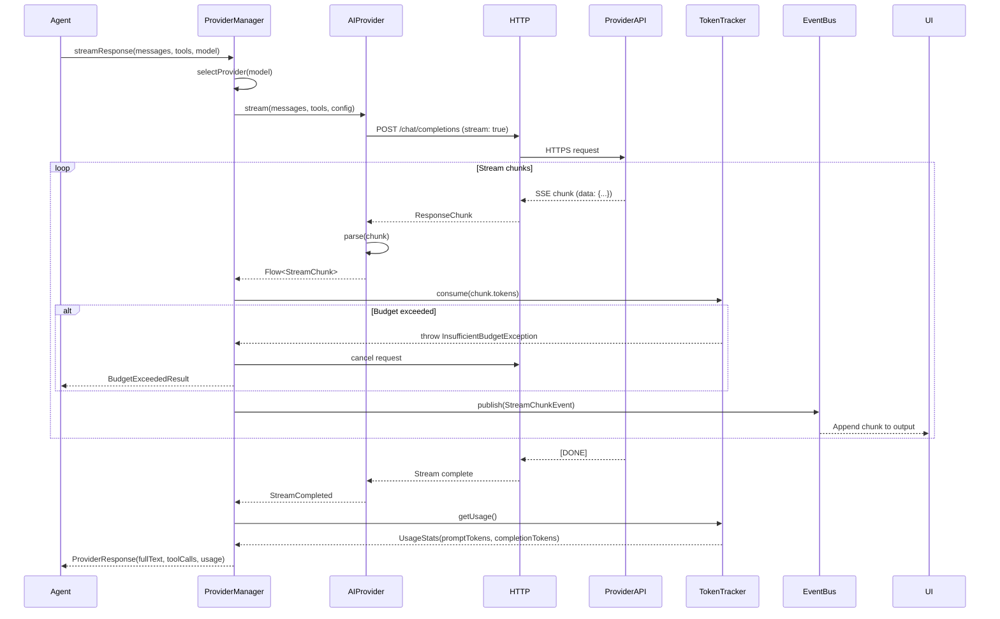

> Back to [PROJECT_SPECIFICATION.md](../PROJECT_SPECIFICATION.md)

# Provider Streaming Flow

This diagram shows how the agent requests a streamed LLM response, how chunks flow from the provider API through token tracking, and how the UI renders them incrementally.

