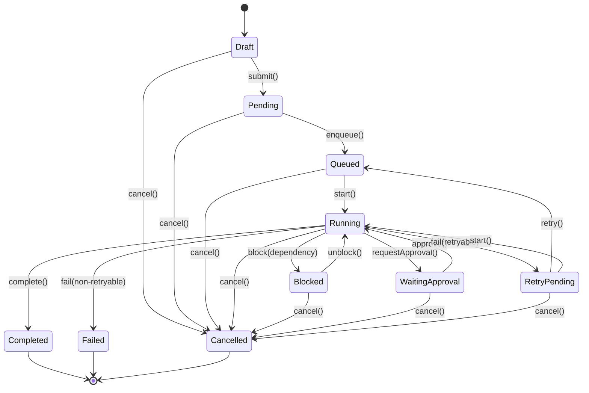

# Task Lifecycle State Machine

> Back to [PROJECT_SPECIFICATION.md](../PROJECT_SPECIFICATION.md)

A **Task** is the fundamental unit of work assigned to an agent in Nexora. The Task Lifecycle tracks each task from initial authoring through execution to final resolution, supporting blocking on dependencies, human approval gates, and retry semantics for transient failures.

## States

| State | Description |
|-------|-------------|
| **Draft** | Task defined locally; not yet submitted to the task manager. |
| **Pending** | Submitted; awaiting dependency resolution before enqueue. |
| **Queued** | Dependencies satisfied; placed in the agent's execution queue. |
| **Running** | Agent is actively executing the task. |
| **Blocked** | Execution stalled due to an unresolved dependency or resource lock. |
| **WaitingApproval** | Task produced an action requiring human approval. |
| **Completed** | Terminal state — task finished successfully. |
| **Failed** | Terminal state — non-retryable failure. |
| **Cancelled** | Terminal state — cancelled by user or parent workflow. |
| **RetryPending** | Failure was retryable; queued for re-execution after backoff. |

## Transitions

| Trigger | From | To | Guard |
|---------|------|----|-------|
| `submit()` | Draft | Pending | Task schema valid |
| `enqueue()` | Pending | Queued | All dependencies completed |
| `start()` | Queued / RetryPending | Running | Agent available |
| `block(dependency)` | Running | Blocked | Dependency not yet completed |
| `unblock()` | Blocked | Running | Dependency resolved |
| `requestApproval()` | Running | WaitingApproval | Action exceeds autonomy scope |
| `approve()` | WaitingApproval | Running | — |
| `complete()` | Running | Completed | Result validated |
| `fail(error)` | Running | Failed | Error is non-retryable |
| `fail(error)` | Running | RetryPending | Error is retryable && retries < max |
| `cancel()` | * | Cancelled | — |
| `retry()` | RetryPending | Queued | Backoff elapsed |

### Invalid Transitions

- **Draft → Running** — must submit and enqueue first.
- **Completed → Running** — terminal state; create a new task.
- **Queued → Completed** — task must pass through Running.
- **Pending → RetryPending** — task has never attempted execution.

## State Diagram

## Implementation Notes

Task state is persisted in the local Room database via the `TaskEntity` table. The `TaskScheduler` service drives transitions automatically — it watches dependency completions to trigger `enqueue()` and applies exponential backoff for `RetryPending` tasks. Approval requests surface through the `ApprovalGateway`, which blocks the agent loop until the user responds.
