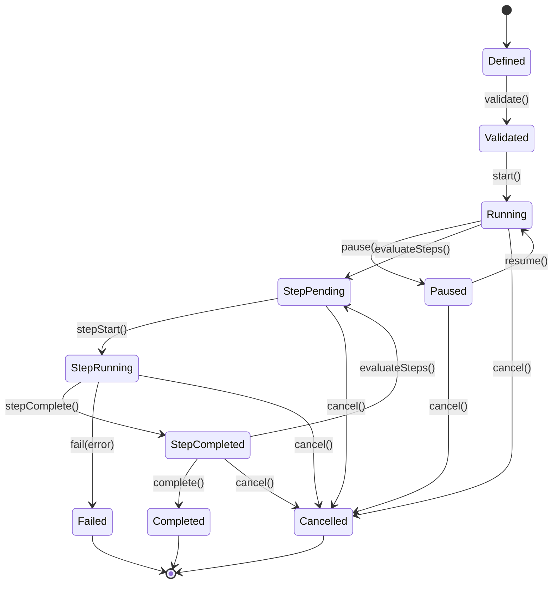

# Workflow Lifecycle State Machine

> Back to [PROJECT_SPECIFICATION.md](../PROJECT_SPECIFICATION.md)

A **Workflow** in Nexora is a directed acyclic graph (DAG) of steps that orchestrates multi-stage agent operations. The workflow-level lifecycle tracks overall progress, while each step maintains its own sub-state internally. Workflows support pause/resume semantics and propagate cancellation across all constituent steps.

## States

| State | Description |
|-------|-------------|
| **Defined** | Workflow DAG structure authored; steps and edges declared. |
| **Validated** | DAG has no cycles, all step inputs/outputs type-checked. |
| **Running** | At least one step is actively executing. |
| **Paused** | No steps executing; can be resumed from pause point. |
| **StepPending** | Next step(s) ready to execute but not yet started. |
| **StepRunning** | A step is actively executing within the workflow. |
| **StepCompleted** | A step has finished; downstream evaluation in progress. |
| **Completed** | Terminal state — all steps finished successfully. |
| **Failed** | Terminal state — a step failed with no fallback path. |
| **Cancelled** | Terminal state — user or system cancelled the workflow. |

## Transitions

| Trigger | From | To | Guard |
|---------|------|----|-------|
| `define()` | [*] | Defined | — |
| `validate()` | Defined | Validated | DAG is acyclic |
| `start()` | Validated | Running | — |
| `pause()` | Running | Paused | — |
| `resume()` | Paused | Running | Pending steps exist |
| `stepStart()` | Running | StepRunning | Upstream steps completed |
| `stepComplete()` | StepRunning | StepCompleted | Step result valid |
| `complete()` | StepCompleted | Completed | No pending steps remain |
| `stepStart()` | StepCompleted | StepRunning | Downstream step eligible |
| `fail(error)` | StepRunning | Failed | No error-handler edge |
| `cancel()` | * | Cancelled | — |

### Step Sub-States

Each step internally tracks: **Pending → Running → Completed / Failed / Skipped**. The workflow engine evaluates step readiness after every `stepComplete()` by walking the DAG for steps whose all upstream dependencies are in the Completed state.

## State Diagram

## Implementation Notes

The `WorkflowEngine` class manages the DAG traversal and step dispatching. It uses a topological sort to determine execution order and maintains an in-memory `StepStatusMap`. Workflow state is persisted to the `workflow` table in Room; step sub-states are stored in the `workflow_step` table. The engine is coroutine-based — each `stepStart()` launches a child job so that independent parallel branches execute concurrently, with structured concurrency ensuring cancellation propagates to all children.
