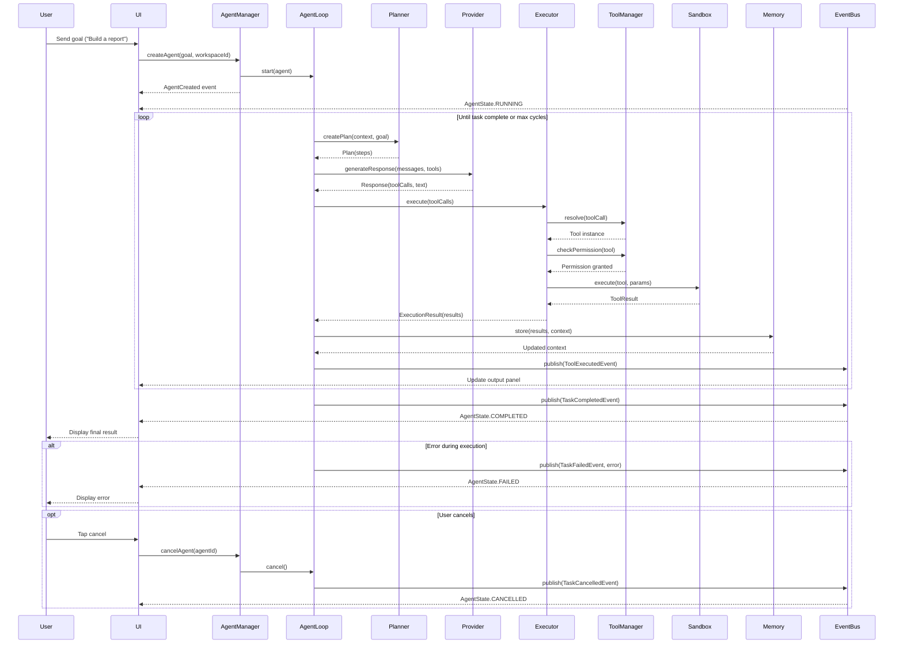

> Back to [PROJECT_SPECIFICATION.md](../PROJECT_SPECIFICATION.md)

# Agent Execution Flow

This diagram illustrates the full lifecycle of a user goal from submission through the agent loop to UI update. The agent iterates — planning, calling the provider, executing tools, and storing results — until the task is complete.

> **Guard conditions:** every transition shown here is enforced by the
> [Agent Lifecycle state machine](../state-machines/AgentLifecycle.md) — e.g.
> terminal states (Completed/Failed/Cancelled) can never re-enter Running;
> `start()` requires `Ready`; `retry()` is bounded by max retries. The sequence
> below assumes those guards hold.

