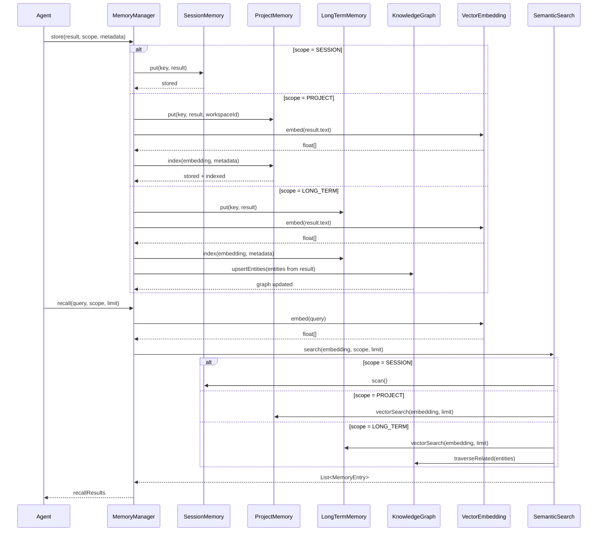

> **Status: DERIVED** for Memory Store Flow visual flow.
> This diagram illustrates Memory Store Flow flow. The canonical definition is in the relevant architecture or state-machine document.
>
> Depends on: the relevant canonical architecture or state-machine document.

> Back to [PROJECT_SPECIFICATION.md](../PROJECT_SPECIFICATION.md)

# Memory Store Flow

This diagram shows how the agent reads from and writes to the multi-tier memory system — session memory for short-term context, project memory for workspace-scoped data, long-term memory for cross-session persistence, and the knowledge graph for entity relationships.

