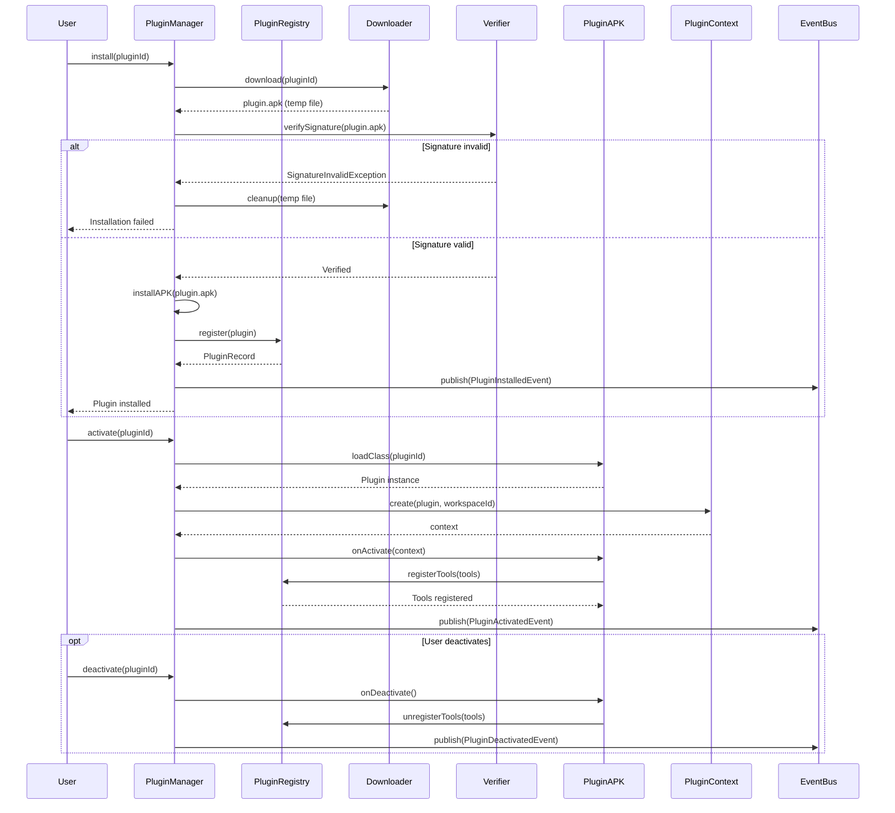

> **Status: DERIVED** for Plugin Lifecycle Flow visual flow.
> This diagram illustrates Plugin Lifecycle Flow flow. The canonical definition is in the relevant architecture or state-machine document.
>
> Depends on: the relevant canonical architecture or state-machine document.

> Back to [PROJECT_SPECIFICATION.md](../PROJECT_SPECIFICATION.md)

# Plugin Lifecycle Flow

This diagram traces the full plugin lifecycle from user-initiated installation through signature verification, activation, tool registration, and eventual deactivation.

