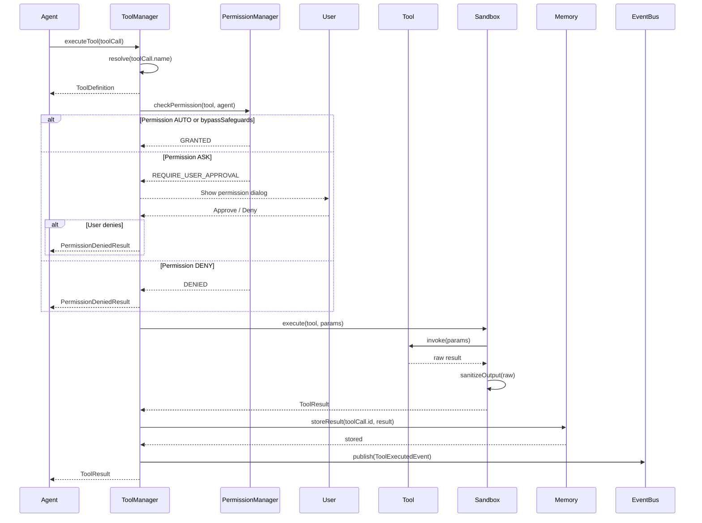

> **Status: DERIVED** for Tool Execution Flow visual flow.
> This diagram illustrates Tool Execution Flow flow. The canonical definition is in the relevant architecture or state-machine document.
>
> Depends on: the relevant canonical architecture or state-machine document.

> Back to [PROJECT_SPECIFICATION.md](../PROJECT_SPECIFICATION.md)

# Tool Execution Flow

This diagram shows the resolved path when an agent requests a tool invocation — from permission checks through sandboxed execution to result storage and event propagation.

