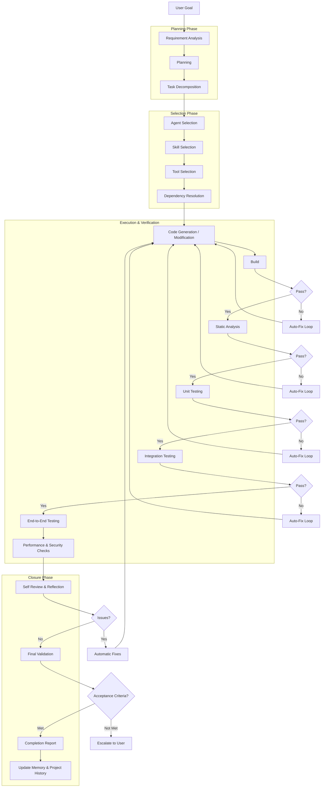

> **Status: DERIVED** for execution pipeline visualization.
> Canonical source: [specs/EXECUTION_LIFECYCLE.md](../../specs/EXECUTION_LIFECYCLE.md) (§2 Software Engineering Pipeline, lines 76-120).
> This diagram introduces no new terminology or architecture.

# Execution Pipeline — Nexora

