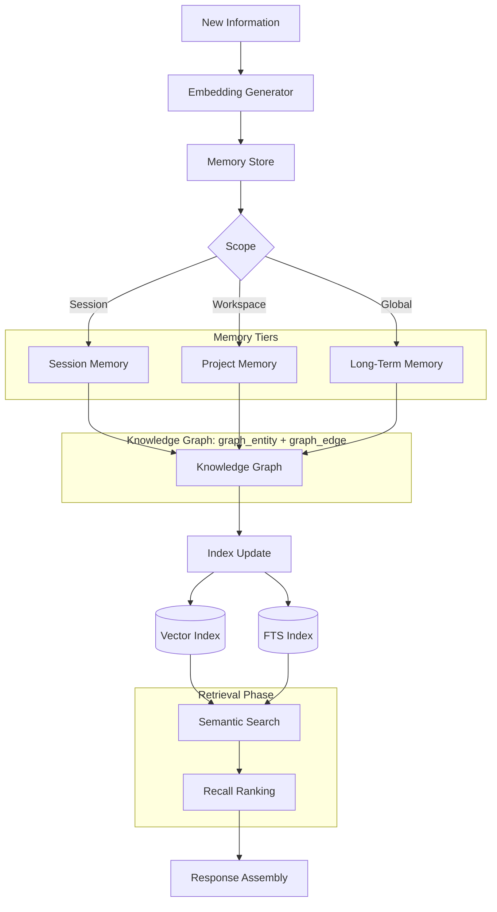

> **Status: DERIVED** for memory pipeline visualization.
> Canonical source: [architecture/MEMORY_SYSTEM.md](../../architecture/MEMORY_SYSTEM.md) (§Memory Flow, lines 99-134).
> This diagram introduces no new terminology or architecture.

# Memory Pipeline — Nexora

