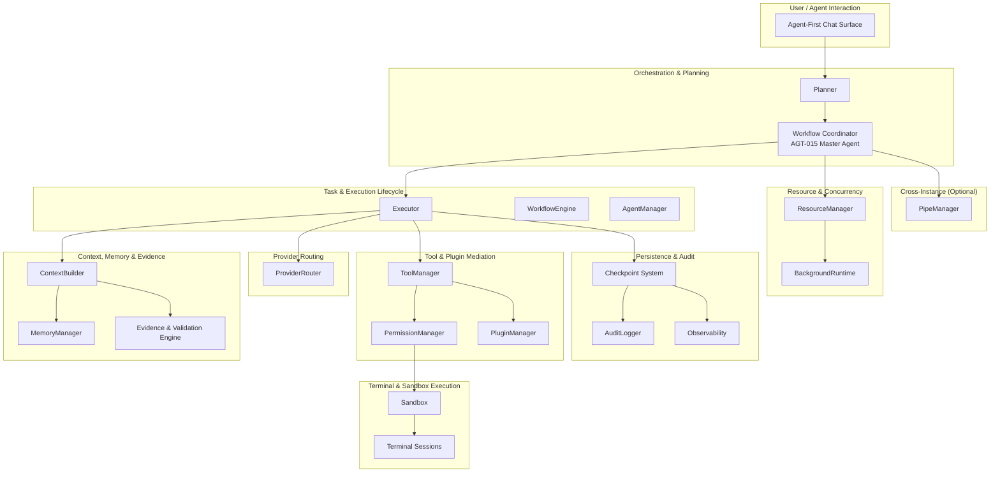

# Embedded Runtime Strategy — Nexora

> This document is a **reconstructed current-state strategy document**. Earlier repository documentation referenced an embedded runtime strategy, but no reachable Git commit contained the original file. This reconstruction is based only on the current Nexora documentation corpus and must not be treated as the original historical artifact.

## Reconstruction Notice

The Nexora repository at `pavan53732/Nexora` references an embedded runtime strategy
document at this path in three live documents:

- `docs/CHANGELOG.md` — claimed a 321-line file was preserved
- `docs/ENVIRONMENT_SETUP.md` — claimed the file was created and committed (Step 5, Step 7, References section)
- `docs/research/NEXORA_VS_ZCODE_CAPABILITY_GAP.md` — listed the file as having been read during audit

Forensic verification across all reachable commits, all refs, `git fsck --full
--no-reflogs --unreachable`, and filesystem search confirms that
`docs/research/EMBEDDED_RUNTIME_STRATEGY.md` **never existed in any Git commit**.

This document is a current-state reconstruction, written against the repository at
HEAD `7f6e8a6` (2026-08-06). It synthesizes the embedded runtime strategy from the
surviving content in `docs/ENVIRONMENT_SETUP.md` §13 and the canonical architecture,
specification, security, and requirements documents.

This document is **not** the original 321-line historical artifact.
This document does **not** claim to have been recovered from Git.
No historical authorship, dates, commit IDs, or implementation status are invented.

## Status and Scope

| Field | Value |
|---|---|
| Status | Reconstructed current-state strategy |
| Scope | Embedded/on-device Nexora runtime |
| Normative authority | Referenced canonical documents (see [Canonical Ownership](#canonical-ownership-and-document-relationships)) |
| Implementation status | Documentation/specification unless explicitly stated otherwise |
| Historical status | Not the original missing artifact |
| Intended audience | Contributors, architects, and reviewers evaluating runtime design |
| Covers | Runtime boundary, responsibilities, execution flow, isolation, security, recovery, resource strategy |
| Does not cover | Android source code implementation, build system configuration, CI/CD, UX design |

All canonical ownership remains with the files listed in
[`docs/CANONICAL_SOURCES.md`](../../docs/CANONICAL_SOURCES.md). This document is a
derived strategy layer that links the canonical sources — it does not override,
replace, or redefine any canonical specification.

## Executive Summary

Nexora's embedded runtime is a local, workspace-isolated, agent-first execution
environment designed for Android. The user interacts with AI **agents** through a chat
surface; the agents plan and coordinate work while the runtime mediates every
operation — provider calls, tool invocations, file access, terminal execution, and
remote-instance delegation — through contracts, permission gates, resource limits, and
audit trails.

The runtime is **embedded** in that it runs on-device within the Nexora application
process, with its own sandbox, state, memory, and scheduling, rather than depending on
a remote server for execution coordination. AI model inference is delegated to external
providers behind an abstraction layer; the runtime never performs inference itself.

Key properties:

- **Agent-first interaction**: infrastructure (sandbox, terminal, runtimes) is internal and agent-invoked per ADR-0006
- **Workspace isolation**: every agent, task, tool, and file operation is scoped to a workspace with enforced boundaries
- **Permission mediation**: every tool call, network access, and device operation passes through the PermissionManager
- **Provider abstraction**: the runtime routes model requests through a provider-agnostic interface with health-aware failover
- **Bounded autonomy**: agents can plan, repair, retry, and self-review within configurable budgets; the runtime escalates to the user at exhaustion
- **Checkpointed recovery**: state is periodically saved and resumes with 100% fidelity after crash or restart
- **Exactly-once discipline**: idempotent tools are safely replayed; non-idempotent effects are reconciled from tool history, never duplicated
- **Graceful degradation**: provider failure → local model → offline read-only with user-visible announcements at each step
- **Deny-by-default**: high-risk capabilities (plugin installation, agent spawning, device access, broadcast) default to DENY
- **Auditability**: every permission decision, tool invocation, provider call, pipe event, and checkpoint is append-only logged

This document explains how these properties compose into a coherent runtime strategy,
referencing the underlying canonical documents throughout.

## Terminology

| Term | Meaning (per Nexora corpus) |
|---|---|
| **Embedded runtime** | The on-device execution environment within the Nexora app that coordinates agents, tasks, tools, providers, sandbox, and persistence — without an external orchestration server |
| **Workspace** | The primary containment entity (ADR-0001): owns agents, tasks, files, memory, sandbox, and settings; fully isolated from other workspaces |
| **Agent** | A specialized role (Planner, Coder, Researcher, etc.) that receives goals, plans steps, invokes tools, and produces results; the Workflow Coordinator (AGT-015) is the Master Agent |
| **Task** | A unit of work with goal, acceptance criteria, dependencies, priority, lifecycle state, and assignee |
| **Execution** | The active agent loop: plan → execute → reflect → repeat, with checkpoints, token budgets, and progress events |
| **Tool** | A capability registered in the tool catalog (28 categories, 350 tools) with a stable `TOOL-###` ID, permission scopes, and schema-validated parameters |
| **Provider** | An external AI model service (OpenAI, Anthropic, Gemini, etc.) behind the `AIProvider` abstraction; the runtime routes requests, tracks health, and handles failover |
| **Plugin** | An installable extension that registers tools, providers, agents, or skills; loaded in isolated classloaders with explicit permission review at install |
| **Terminal session** | An internal, agent-invoked shell session (subprocess or PTY) with working-dir boundaries, output caps, timeout disciplines, and session restore |
| **Checkpoint** | A periodic snapshot of agent state (plan, step index, memory, token usage) saved transactionally for crash recovery |
| **Evidence & Validation** | The engine (EV) that classifies every significant claim as VERIFIED/DERIVED/ESTIMATED/UNKNOWN/USER_PROVIDED and gates completion on acceptance criteria |
| **Degradation ladder** | The ordered fallback path: primary provider → failover → local model → offline read-only, with user-visible announcements at each descent |
| **Remote/peer instance** | Another Nexora install discovered and paired through pipes (S5) for cross-instance task delegation |

## Strategy Principles

| # | Principle | Description | Source |
|---|---|---|---|
| 1 | Agent-first interaction | Users interact with agents; sandbox, terminal, and runtimes are internal infrastructure (ADR-0006) | [`../docs/adr/ADR-0006-Agent-First-Interaction-Model.md`](../../docs/adr/ADR-0006-Agent-First-Interaction-Model.md), [`specs/TERMINAL.md`](../../specs/TERMINAL.md) |
| 2 | Local state ownership | Workspace, task, agent, memory, and checkpoint state is owned by the local runtime; providers are stateless integrations | [`architecture/RUNTIME.md`](../../architecture/RUNTIME.md), [`architecture/AGENT_RUNTIME.md`](../../architecture/AGENT_RUNTIME.md) |
| 3 | Workspace isolation | Every workspace is an isolated sandbox; cross-workspace access is blocked at the filesystem, memory, and event-bus level | [`security/SandboxPolicy.md`](../../security/SandboxPolicy.md), [`requirements/FR.md`](../../requirements/FR.md) (§FR-W006, §FR-S001..018) |
| 4 | Permission mediation | Every tool invocation, network call, and device action passes through the PermissionManager with ASK/ALLOW/DENY decisions | [`security/PermissionModel.md`](../../security/PermissionModel.md) |
| 5 | Provider abstraction | The runtime never depends on a specific provider; all provider logic is behind the `AIProvider` interface | [`architecture/PROVIDER_SYSTEM.md`](../../architecture/PROVIDER_SYSTEM.md), [`docs/adr/ADR-0005-Provider-Abstraction.md`](../../docs/adr/ADR-0005-Provider-Abstraction.md) |
| 6 | Tool contract enforcement | Tools are registered by stable ID; parameters are schema-validated; permissions are checked per invocation; execution is sandboxed | [`architecture/TOOL_SYSTEM.md`](../../architecture/TOOL_SYSTEM.md), [`protocols/Tool-Protocol.md`](../../protocols/Tool-Protocol.md) |
| 7 | Evidence before claims | The Evidence & Validation Engine classifies every significant assertion before it reaches the user; unverified statements are blocked | [`specs/CONTEXT_MANAGEMENT.md`](../../specs/CONTEXT_MANAGEMENT.md) (§7), [`requirements/FR.md`](../../requirements/FR.md) (§FR-EV-001..006) |
| 8 | Bounded autonomy | Agents can repair and retry within hard limits; the runtime escalates to the user at budget exhaustion — never a silent stop | [`specs/AUTONOMY_STABILITY.md`](../../specs/AUTONOMY_STABILITY.md) (§FR-AS-001, §FR-AS-003) |
| 9 | Checkpointed recovery | State is checkpointed periodically (30 s default) with transactional WAL writes; resume achieves 100% fidelity | [`specs/BACKGROUND_EXECUTION.md`](../../specs/BACKGROUND_EXECUTION.md) (§3, §6), [`requirements/NFR.md`](../../requirements/NFR.md) (§NFR-REL-002) |
| 10 | Exactly-once discipline | Idempotent tools are safely replayed; non-idempotent effects are reconciled from tool history, never duplicated | [`specs/AUTONOMY_STABILITY.md`](../../specs/AUTONOMY_STABILITY.md) (§FR-AS-007), [`requirements/NFR.md`](../../requirements/NFR.md) (§NFR-REL-012) |
| 11 | Graceful degradation | Provider failure → local model → offline read-only; each step announced, never a silent crash | [`specs/AUTONOMY_STABILITY.md`](../../specs/AUTONOMY_STABILITY.md) (§FR-AS-008), [`architecture/PROVIDER_SYSTEM.md`](../../architecture/PROVIDER_SYSTEM.md) |
| 12 | Resource-bounded concurrency | Agent parallelism is dynamically capped by the SA-3 formula: `min(memory_budget / per_agent_est, cpu_cores, configurable_max)` | [`architecture/MULTI_AGENT_SYSTEM.md`](../../architecture/MULTI_AGENT_SYSTEM.md) (§SA-3) |
|| 13 | Deny-by-default (unknown scopes) | Unknown and undeclared scope identifiers are always denied. Known scopes follow their declared defaults per the Explicit Risk-Based Scope Defaults in `security/PermissionModel.md`. High-risk operations (plugin install, agent create) default to `ASK` and require explicit user approval. | [`security/PermissionModel.md`](../../security/PermissionModel.md) (§Explicit Risk-Based Scope Defaults) |
| 14 | No silent failure | Every exhaustion, timeout, and degradation is user-visible; escalation paths are documented; no capability upgrades silently | [`specs/AUTONOMY_STABILITY.md`](../../specs/AUTONOMY_STABILITY.md) (§FR-AS-003), [`specs/BACKGROUND_EXECUTION.md`](../../specs/BACKGROUND_EXECUTION.md) (§8) |

## Runtime Boundary and Responsibilities

The embedded runtime sits between the agent interaction surface and the external
integrations (providers, plugins, remote instances). It owns local state, enforces
contracts, and mediates every operation — but it does **not** perform provider
inference, does **not** bypass tool sandboxing, and does **not** assume cross-workspace
access.

| Responsibility | Owned by embedded runtime | Delegated or integrated component | Governing source |
|---|---|---|---|
| Workspace state | Yes — creation, switching, archival, deletion, isolation | Sandbox stores filesystem state | [`architecture/RUNTIME.md`](../../architecture/RUNTIME.md), [`state-machines/WorkspaceLifecycle.md`](../../state-machines/WorkspaceLifecycle.md) |
| Agent lifecycle | Yes — registration, start, pause, resume, checkpoint, cancel | Agent type definitions registered in AgentRegistry | [`architecture/AGENT_RUNTIME.md`](../../architecture/AGENT_RUNTIME.md), [`state-machines/AgentLifecycle.md`](../../state-machines/AgentLifecycle.md) |
| Task/execution lifecycle | Yes — creation, queueing, dependency resolution, scheduling, completion, error recovery | WorkflowEngine for graph progression; ProviderRouter for model selection | [`specs/EXECUTION_LIFECYCLE.md`](../../specs/EXECUTION_LIFECYCLE.md), [`state-machines/TaskLifecycle.md`](../../state-machines/TaskLifecycle.md) |
| Tool authorization | Yes — every tool call passes through PermissionManager | Tool implementations execute in sandbox | [`security/PermissionModel.md`](../../security/PermissionModel.md), [`architecture/TOOL_SYSTEM.md`](../../architecture/TOOL_SYSTEM.md) |
| Provider routing | Yes — health checks, failover, profile selection | ProviderPlugin performs actual inference | [`architecture/PROVIDER_SYSTEM.md`](../../architecture/PROVIDER_SYSTEM.md) |
| Memory/context handling | Yes — assembly, summarization, retrieval, tagging, freshness | Embedding generation delegated to provider | [`specs/CONTEXT_MANAGEMENT.md`](../../specs/CONTEXT_MANAGEMENT.md), [`architecture/MEMORY_SYSTEM.md`](../../architecture/MEMORY_SYSTEM.md) |
| Terminal execution | Yes — session lifecycle, working-dir boundary, output caps, timeout, restore | Subprocess/PTY execution in sandbox | [`specs/TERMINAL.md`](../../specs/TERMINAL.md), [`lifecycle/TerminalSessionLifecycle.md`](../../lifecycle/TerminalSessionLifecycle.md) |
| Checkpoint/recovery | Yes — periodic saves, transactional WAL, restart resume with fidelity | Background Execution service for lifecycle | [`specs/BACKGROUND_EXECUTION.md`](../../specs/BACKGROUND_EXECUTION.md) (§3, §6) |
| Evidence/validation | Yes — statement classification, confidence scoring, completion gates | Reviewer agent pass for important tasks | [`specs/CONTEXT_MANAGEMENT.md`](../../specs/CONTEXT_MANAGEMENT.md) (§7) |
| Background execution | Yes — foreground service, WorkManager handoff, Doze awareness, battery optimization detection | Android platform services | [`specs/BACKGROUND_EXECUTION.md`](../../specs/BACKGROUND_EXECUTION.md) |
| Remote instance pipes | Yes — pairing, connect, heartbeat, pipe lifecycle, delegation dispatch | Remote sandbox and provider profiles owned by remote instance | [`specs/PIPES.md`](../../specs/PIPES.md), [`state-machines/InstanceLifecycle.md`](../../state-machines/InstanceLifecycle.md) |

## Logical Architecture

The embedded runtime is composed of 17 coordinated modules (per
[`architecture/RUNTIME.md`](../../architecture/RUNTIME.md)) arranged in conceptual layers.
This diagram is **derived** from the canonical module inventory, not a new module
definition.



**Note:** This is a conceptual architecture diagram derived from the canonical module
descriptions in [`architecture/RUNTIME.md`](../../architecture/RUNTIME.md) and
[`docs/MODULE_BOUNDARIES.md`](../../docs/MODULE_BOUNDARIES.md). It does not introduce new
package names, class names, or APIs. The arrows represent logical dependency direction,
not runtime call-graph edges.

## End-to-End Execution Flow

The following flow traces a user goal from entry to completion, referencing the owning
document at each step. This is a synthesis across [`specs/EXECUTION_LIFECYCLE.md`](../../specs/EXECUTION_LIFECYCLE.md)
and the canonical architecture documents — it does not redefine the lifecycle.

1. **User intent** enters through the agent-first chat surface
   ([`docs/adr/ADR-0006-Agent-First-Interaction-Model.md`](../../docs/adr/ADR-0006-Agent-First-Interaction-Model.md),
   [`requirements/FR.md`](../../requirements/FR.md) §FR-U011).

2. **Workspace and agent context** are resolved: the active workspace, agent profile,
   and permissions are loaded from persistent state
   ([`models/Workspace.md`](../../models/Workspace.md), [`models/Agent.md`](../../models/Agent.md)).

3. **Deliberation gate** classifies the message as FAST / BALANCED / THOROUGH; the
   reasoning effort level (OFF through MAX) is resolved from the override hierarchy
   ([`specs/CONTEXT_MANAGEMENT.md`](../../specs/CONTEXT_MANAGEMENT.md) §6,
   [`requirements/FR.md`](../../requirements/FR.md) §FR-RN-003, §FR-RN-007).

4. **Permission and autonomy gates** evaluate: autonomy mode (Manual / Assisted /
   Autopilot per [`requirements/FR.md`](../../requirements/FR.md) §FR-S016), high-risk
   scopes (deny-by-default per [`security/PermissionModel.md`](../../security/PermissionModel.md)).

5. **Task and execution context** are created: the Planner decomposes the goal into an
   ExecutionPlan with dependencies, validation criteria, and resource estimates
   ([`specs/EXECUTION_LIFECYCLE.md`](../../specs/EXECUTION_LIFECYCLE.md) §1,
   [`architecture/RUNTIME.md`](../../architecture/RUNTIME.md)).

6. **Context assembly**: the ContextBuilder constructs the context window from system
   prompt → state checkpoint → active working set → semantic retrieval → rolling
   summary, with freshness validation and trust tagging
   ([`specs/CONTEXT_MANAGEMENT.md`](../../specs/CONTEXT_MANAGEMENT.md) §2–4).

7. **Provider routing**: the request is routed through the active provider profile;
   reasoning-capable models are selected for THOROUGH / X_HIGH / MAX levels; fail-fast
   at X_HIGH/MAX if unavailable
   ([`architecture/PROVIDER_SYSTEM.md`](../../architecture/PROVIDER_SYSTEM.md),
   [`requirements/FR.md`](../../requirements/FR.md) §FR-RN-004).

8. **Tool call validation**: if the response includes tool calls, each is validated
   against the registered tool catalog (schema, permissions, sandbox requirement) before
   execution ([`architecture/TOOL_SYSTEM.md`](../../architecture/TOOL_SYSTEM.md),
   [`registry/TOOLS.md`](../../registry/TOOLS.md)).

9. **Tool execution in sandbox**: validated tools execute within the workspace sandbox
   with process isolation, filesystem boundaries, network restrictions, and resource
   quotas ([`security/SandboxPolicy.md`](../../security/SandboxPolicy.md),
   [`specs/TERMINAL.md`](../../specs/TERMINAL.md)).

10. **Evidence and validation**: the Evidence & Validation Engine classifies each
    result statement as VERIFIED / DERIVED / ESTIMATED / UNKNOWN; LOW-confidence
    assertions trigger ASK gates; important tasks require a Reviewer agent pass before
    completion ([`specs/CONTEXT_MANAGEMENT.md`](../../specs/CONTEXT_MANAGEMENT.md) §7,
    [`requirements/FR.md`](../../requirements/FR.md) §FR-EV-001..006).

11. **Result merging and self-review**: the agent reflects on the step result; the
    coordinator merges sub-agent outputs in dependency order; SA-5 plan-vs-actual
    reporting distinguishes DONE-VERIFIED / DONE-UNVERIFIED / ATTEMPTED-FAILED /
    NOT-ATTEMPTED ([`specs/AUTONOMY_STABILITY.md`](../../specs/AUTONOMY_STABILITY.md),
    [`architecture/MULTI_AGENT_SYSTEM.md`](../../architecture/MULTI_AGENT_SYSTEM.md)
    §SA-5).

12. **State persistence**: the checkpoint is saved transactionally (WAL, CRC-verified);
    tool history, token usage, and audit entries are recorded
    ([`specs/BACKGROUND_EXECUTION.md`](../../specs/BACKGROUND_EXECUTION.md) §3,
    [`architecture/RUNTIME.md`](../../architecture/RUNTIME.md)).

13. **Grounded result**: the agent returns the result to the user through the activity
    feed with citations, confidence metadata, and evidence references
    ([`specs/CONTEXT_MANAGEMENT.md`](../../specs/CONTEXT_MANAGEMENT.md) §5,
    [`requirements/FR.md`](../../requirements/FR.md) §FR-GND-001..006).

14. **Failure handling**: any interruption follows the documented recovery/degradation
    path (see [Background Execution and Recovery](#background-execution-and-recovery)
    below).

## Workspace and Isolation Model

The runtime enforces isolation at every boundary. The workspace is the primary
containment unit; agents, tools, providers, terminals, and remote pipes all operate
within scoped boundaries.

| Boundary | Protected asset | Enforcement concept | Source |
|---|---|---|---|
| Workspace | Files, memory, task state, agent configs | Workspace ID on every operation; filesystem rooted at `/data/.../sandbox/workspaces/{id}/`; event bus drops cross-workspace messages | [`security/SandboxPolicy.md`](../../security/SandboxPolicy.md) (§1, §8) |
| Agent | Agent-scoped actions, permissions, autonomy level | Agent override in permission hierarchy; per-agent resource limits; trust score per agent + workspace | [`security/PermissionModel.md`](../../security/PermissionModel.md) (§Hierarchy), [`specs/AUTONOMY_STABILITY.md`](../../specs/AUTONOMY_STABILITY.md) (§FR-AS-005) |
| Tool | Tool capabilities, parameter schemas | Registry validation before invocation; permission scopes checked per-call; sandbox isolation for execution | [`architecture/TOOL_SYSTEM.md`](../../architecture/TOOL_SYSTEM.md), [`protocols/Tool-Protocol.md`](../../protocols/Tool-Protocol.md) |
| Provider | API keys, endpoints, configurations | Per-provider Keystore aliases; isolated classloaders; base URL confinement; no cross-provider data access | [`architecture/PROVIDER_SYSTEM.md`](../../architecture/PROVIDER_SYSTEM.md), [`requirements/FR.md`](../../requirements/FR.md) §FR-P013, [`requirements/NFR.md`](../../requirements/NFR.md) §NFR-SEC-011..012 |
| Sandbox | Process execution, filesystem, network | Path canonicalization; no `/sdcard` or `/system`; symlink blocking; egress proxy + allowlist; process and disk quotas | [`security/SandboxPolicy.md`](../../security/SandboxPolicy.md) (§2–7) |
| Terminal | Processes, output, working directory | Working-dir confined to workspace root; output caps (256 KB subprocess, 1 MB PTY); timeout discipline; session restore audit | [`specs/TERMINAL.md`](../../specs/TERMINAL.md) (§Execution Model, §Working-Dir, §Output Caps, §Restore) |
| Plugin | Code execution, registered capabilities | Isolated DexClassLoader; no host-class access; activation is transactional (rollback on failure); install requires signature + user permission review | [`architecture/PLUGIN_SYSTEM.md`](../../architecture/PLUGIN_SYSTEM.md), [`docs/api/Plugin-API.md`](../../docs/api/Plugin-API.md) |
| Remote pipe | Peer workspace, task handoffs, credentials | Explicit pairing (Ed25519 fingerprint, QR/6-word confirmation); mTLS 1.3 (pinned certs, no CA fallback); per-workspace pipe binding; DLP scan on outbound bodies; credential firewall (keys never serialized into pipe payloads) | [`specs/PIPES.md`](../../specs/PIPES.md) (§3, §5, §8), [`requirements/NFR.md`](../../requirements/NFR.md) §NFR-SEC-014 |

**Important:** Many of these isolation controls are status **Partial** or **Planned**
in the ThreatModel. The table above describes the *specified* isolation contract, not
claiming full implementation. See [Security Threat Boundaries](#security-threat-boundaries)
for the current status of each threat.

## Agent-First Product Boundary

The distinction between internal runtime infrastructure and user-facing agent
interaction is codified in ADR-0006
([`docs/adr/ADR-0006-Agent-First-Interaction-Model.md`](../../docs/adr/ADR-0006-Agent-First-Interaction-Model.md)):

- The **sandbox, embedded terminal, runtimes, and execution engine** are internal
  implementation details — the user never opens them directly.
- The **single primary interaction surface** is chat with agents; results (tool-call
  cards, output excerpts, file diffs) surface in the activity feed.
- The **bottom navigation** is Workspace, Tasks, Settings — no Terminal, Sandbox, or
  infrastructure tabs.
- **Observability** (execution logs, audit trail, execution history) is a user-facing
  *read-only* surface for trust and debugging, not an operational interface.
- A **developer mode** may later expose infrastructure views, but never as primary
  features.
- **Settings surfaces** (e.g., Settings → Pipes for cross-instance pairing, Settings →
  Model Config → Reasoning for effort control) are the only non-chat interaction points
  and are explicitly defined, not ad-hoc.

This boundary means the embedded runtime is *invisible infrastructure* from the user's
perspective. The strategy document describes infrastructure behavior for contributors
and architects — it does not redefine the agent-first product boundary.

## Context, Memory, Reasoning, and Evidence

The runtime's cognitive pipeline is defined in
[`specs/CONTEXT_MANAGEMENT.md`](../../specs/CONTEXT_MANAGEMENT.md). It supports:

- **Working context** — five-layer priority-ordered assembly (system prompt, state
  checkpoint, active working set, semantic retrieval, rolling summary) with truncation
  restricted to Layer 5
- **Progressive summarization** — triggered at 75% token budget; fidelity-checked;
  idempotent artifacts
- **Freshness and trust tagging** — every context chunk carries a source, timestamp,
  trust level, and workspace scope; untrusted content is isolated in
  `<untrusted_content>` blocks
- **Memory curation** — milestone-level facts and lessons stored at step boundaries,
  not raw transcripts
- **Response grounding (RG)** — every factual claim must trace to a verified tool
  result; tool-before-claim rule; structured citations; uncertainty disclosure;
  plan-vs-actual honesty
- **Reasoning effort scale** — six levels (OFF / LOW / MEDIUM / HIGH / X_HIGH / MAX)
  with an override hierarchy (task → agent → workspace → global → default MEDIUM);
  OFF disables reasoning passes but **does not** disable evidence/grounding gates
- **Evidence & Validation (EV)** — five-way statement classification (VERIFIED /
  DERIVED / ESTIMATED / UNKNOWN / USER_PROVIDED); structured HIGH/MEDIUM/LOW
  confidence; zero-assumption mode; 7 consolidated guardrails; completion validation
  with mandatory Reviewer pass for important tasks

**Critical distinction:** Reasoning depth (the deliberation gate and effort scale)
controls *how much* thinking the model performs before answering. Evidence and
grounding (RG/EV rules) control *whether* claims are verified. OFF disables reasoning
passes; it does **not** disable evidence discipline. The runtime always enforces RG/EV
gates regardless of reasoning level.

## Background Execution and Recovery

The runtime survives app minimization, device sleep, and crashes. Background execution
is specified in [`specs/BACKGROUND_EXECUTION.md`](../../specs/BACKGROUND_EXECUTION.md).

| Failure or interruption | Runtime response | User-visible result | Governing source |
|---|---|---|---|
| App process interruption | Foreground service keeps agent alive; checkpoint at last safe boundary; resume with 100% fidelity | Persistent notification with progress; seamless resume | [`specs/BACKGROUND_EXECUTION.md`](../../specs/BACKGROUND_EXECUTION.md) (§1, §3, §6), [`requirements/NFR.md`](../../requirements/NFR.md) §NFR-REL-002 |
| Provider unavailable | Health-based failover to next provider (degradation ladder step 2) | Agent continues with alternative provider; `provider_switched` notification | [`specs/AUTONOMY_STABILITY.md`](../../specs/AUTONOMY_STABILITY.md) (§FR-AS-008), [`architecture/PROVIDER_SYSTEM.md`](../../architecture/PROVIDER_SYSTEM.md) |
| Network loss mid-task | Degradation ladder descent; eventual offline read-only if unrecoverable | Announced descent; read-only mode indicator; cached responses | [`specs/AUTONOMY_STABILITY.md`](../../specs/AUTONOMY_STABILITY.md) (§FR-AS-008), [`requirements/NFR.md`](../../requirements/NFR.md) §NFR-REL-006 |
| Tool timeout | Process killed; partial output returned; NXR-2002; agent re-plans from failure | Timeout indicated in activity feed; bounded repair (max 3 cycles) | [`specs/AUTONOMY_STABILITY.md`](../../specs/AUTONOMY_STABILITY.md) (§FR-AS-001), [`architecture/TOOL_SYSTEM.md`](../../architecture/TOOL_SYSTEM.md) |
| Non-idempotent tool crash mid-call | Not replayed; effect reconciled from tool history; replay log deduplicates | Task resumes from checkpoint without duplicate side effects | [`specs/AUTONOMY_STABILITY.md`](../../specs/AUTONOMY_STABILITY.md) (§FR-AS-007), [`requirements/NFR.md`](../../requirements/NFR.md) §NFR-REL-012 |
| Checkpoint corruption | Fall back to last-known-good checkpoint; bounded restore attempts (3); if persistent, mark FAILED | User notified; task may be retried manually | [`architecture/RUNTIME.md`](../../architecture/RUNTIME.md), [`specs/BACKGROUND_EXECUTION.md`](../../specs/BACKGROUND_EXECUTION.md) (§3) |
| Battery restrictions (OEM) | Foreground service disabled; WorkManager-only mode; checkpoint interval reduced (10 s); autonomy forced to Manual | Notification of degraded mode; no real-time progress; `agent_done` only at completion | [`specs/BACKGROUND_EXECUTION.md`](../../specs/BACKGROUND_EXECUTION.md) (§8), [`docs/DECISION_LOG.md`](../../docs/DECISION_LOG.md) (DL-021) |
| Resource cap reached (disk, memory, processes) | Graceful termination with partial results; NXR-7xxx; user notification; offers quota adjustment | Task paused; resource exhaustion visible in activity feed | [`security/SandboxPolicy.md`](../../security/SandboxPolicy.md) (§4–6, §10), [`requirements/FR.md`](../../requirements/FR.md) §FR-AS-003 |
| Mid-task disconnect (remote pipe) | Subtask marked Blocked; heartbeats continue for timeout window; escalate per FR-AS-003; resume from checkpoint on reconnect | Task blocked; notified; automatically resumes on reconnection | [`specs/PIPES.md`](../../specs/PIPES.md) (§6, §9) |
| Android 15 6-hour foreground cap | Preemptive handoff at 5.5 h: graceful checkpoint → service teardown → WorkManager handoff → resume | Seamless continuation; no interruption in agent progress | [`specs/BACKGROUND_EXECUTION.md`](../../specs/BACKGROUND_EXECUTION.md) (§7.1) |

**Requirement ID usage note:** FR-AS-001 is used only for bounded repair (max 3 repair
cycles, then escalation). FR-AS-002 for heartbeat/checkpoint interval and watchdog
timing. FR-AS-007 for idempotency declarations and replay log. NFR-REL-002 for
checkpoint resume fidelity. NFR-REL-012 for exactly-once recovery. FR-AS-013 is
**undefined** in the current FR.md — it is deliberately absent from this document.

## Resource and Performance Strategy

Canonical performance targets are owned by
[`docs/PERFORMANCE_BUDGET.md`](../../docs/PERFORMANCE_BUDGET.md) with requirement-level
backing in [`requirements/NFR.md`](../../requirements/NFR.md).

| Metric | Target/threshold | Meaning | Source |
|---|---|---|---|
| Cold start | Target 2,000 ms; warning 3,000 ms; critical 5,000 ms | App launch (killed → first frame) | [`docs/PERFORMANCE_BUDGET.md`](../../docs/PERFORMANCE_BUDGET.md), [`requirements/NFR.md`](../../requirements/NFR.md) §NFR-PERF-001 |
| Warm start | Target 500 ms; warning 800 ms | Background → foreground | [`docs/PERFORMANCE_BUDGET.md`](../../docs/PERFORMANCE_BUDGET.md) |
| App memory — idle, no agents | Target 128 MB; warning 200 MB | Application RSS with no active execution | [`docs/PERFORMANCE_BUDGET.md`](../../docs/PERFORMANCE_BUDGET.md) |
| App memory — single agent active | Target 256 MB; warning 384 MB; critical 512 MB | RSS with one agent loop running | [`docs/PERFORMANCE_BUDGET.md`](../../docs/PERFORMANCE_BUDGET.md) |
| App memory — 3+ concurrent agents | Target 384 MB; warning 512 MB | Budgeted for SA-3 parallelism | [`docs/PERFORMANCE_BUDGET.md`](../../docs/PERFORMANCE_BUDGET.md) |
| Idle RSS (NFR-PERF-005) | Under 512 MB | Profiler measurement on mid-range device | [`requirements/NFR.md`](../../requirements/NFR.md) §NFR-PERF-005 |
| Per-workspace sandbox memory cap | 256 MB aggregate RSS | All processes in workspace; deny new spawns at cap | [`security/SandboxPolicy.md`](../../security/SandboxPolicy.md) (§5) |
| Agent concurrency cap | SA-3 dynamic formula | `min(memory_budget / per_agent_est, cpu_cores, configurable_max)`; default 3; high-end 8–16 | [`architecture/MULTI_AGENT_SYSTEM.md`](../../architecture/MULTI_AGENT_SYSTEM.md) (§SA-3) |
| Per-process RSS cap | 128 MB | Kill on exceed with NXR-7004 | [`security/SandboxPolicy.md`](../../security/SandboxPolicy.md) (§5) |
| Workspace disk quota | Default 500 MB | Alerts at 80%/90%/100%; writes blocked at cap | [`security/SandboxPolicy.md`](../../security/SandboxPolicy.md) (§6) |
| Max concurrent processes per workspace | 8 | NXR-7002 on spawn beyond limit | [`security/SandboxPolicy.md`](../../security/SandboxPolicy.md) (§4) |

The SA-3 concurrency cap formula:

```
max_parallel_agents = min(
    memory_budget / per_agent_memory_estimate,
    cpu_cores,
    configurable_max
)
```

- Default: 3 sub-agents per workspace
- High-end (8+ CPU cores, 8 GB+ RAM): cap rises to 8–16
- Enforced by the ResourceManager per-workspace
- At capacity, additional delegation requests are queued (not rejected)

**Important:** These metrics describe *different* measurements and must not be
conflated. The per-workspace sandbox memory cap (256 MB aggregate, SandboxPolicy §5) is
distinct from the idle RSS budget (512 MB, NFR-PERF-005) and the single-active-agent
budget (256 MB target, PERFORMANCE_BUDGET). The concurrency cap is a
parallelism policy, not a memory metric.

## Provider, Tool, Plugin, and Terminal Integration

### Providers

The runtime abstracts provider selection behind the `AIProvider` interface
([`architecture/PROVIDER_SYSTEM.md`](../../architecture/PROVIDER_SYSTEM.md)). Key
properties:

- **Provider-agnostic routing**: the runtime never depends on a specific provider
  implementation; adapters own model-specific mapping
- **Reasoning-effort mapping**: the `ReasoningEffort` enum (OFF/LOW/MEDIUM/HIGH/X_HIGH/MAX)
  maps to provider-specific reasoning parameters per adapter; OFF omits the parameter
  entirely
- **Key isolation**: each provider's API key is stored in a Keystore-backed alias;
  provider code receives only its own key reference
- **Network confinement**: provider HTTP clients connect only to configured `baseUrl`;
  TLS 1.3 with certificate pinning
- **Health-aware failover**: periodic health checks; unhealthy providers are excluded
  from routing; the degradation ladder handles complete provider loss

### Tools

The tool system ([`architecture/TOOL_SYSTEM.md`](../../architecture/TOOL_SYSTEM.md),
[`registry/TOOLS.md`](../../registry/TOOLS.md)) manages 350 tools across 28 categories:

- **Stable registration**: every tool has a `TOOL-###` ID, parameter schema, required
  permissions, and lifecycle phase
- **Permission gating**: every invocation passes through the PermissionManager
- **Sandboxed execution**: tools execute within the workspace sandbox with resource
  limits
- **Audit trail**: every invocation is recorded with timestamp, agent, parameters,
  result, permission decision
- **Reserved IDs**: `TOOL-403` (device_camera_stream) and `TOOL-404` (device_audio_stream)
  are reserved for G5 real-time streaming and must not be reused

### Plugins

Plugins extend the runtime with additional tools, providers, agents, and skills
([`architecture/PLUGIN_SYSTEM.md`](../../architecture/PLUGIN_SYSTEM.md)):

- **Least-privilege manifest**: every plugin declares required scopes at install
- **User review**: scopes are reviewed before installation; denied-by-default for
  high-risk scopes
- **Isolated classloader**: plugins run in a DexClassLoader with no access to host
  internals
- **Transactional activation**: activation failure rolls back all capability
  registrations

### Terminal

The terminal is an internal, agent-invoked infrastructure component
([`specs/TERMINAL.md`](../../specs/TERMINAL.md)):

- **Subprocess vs PTY**: short-lived commands use subprocess mode (stateless, not
  restorable); interactive sessions use PTY (stateful, fully restorable)
- **Working-directory boundary**: `chdir` outside workspace root is denied
- **Output caps**: 256 KB default for subprocess, 1 MB for interactive PTY
- **Timeout discipline**: 60 s for subprocess, 300 s for interactive PTY; 120 s
  heartbeat watchdog
- **Session restore**: PTY sessions checkpoint on SUSPENDED and restore with working-dir
  reconstruction and input buffer replay
- **No user-facing terminal tab**: ADR-0006; output surfaces in the agent activity feed

## Cross-Instance and Remote Runtime Extension

Multi-instance pipes (S5, [`specs/PIPES.md`](../../specs/PIPES.md)) extend the runtime to
coordinate work across process and device boundaries without moving local authority:

- **Local runtime is authoritative**: each instance owns its own workspace, agents,
  sandbox, memory, and provider profiles; pipes are a delegation transport, not a
  shared runtime
- **Pairing is explicit**: instances discover each other via mDNS (LAN) or rendezvous
  directory (same machine); pairing requires user-confirmed Ed25519 fingerprint match
  (QR or 6-word code); one-tap revocation
- **mTLS transport**: TLS 1.3 with pinned `pipeKey` certificates; no CA, no self-signed
  prompts; DLP scan on outbound bodies
- **Workspace binding**: each pipe is bound to exactly one exposed workspace;
  cross-workspace routing is rejected
- **Per-pipe permissions**: `instance:pair` and `instance:connect` default to ASK;
  `instance:broadcast` defaults to DENY
- **Replay prevention**: every payload carries a monotonically increasing `pipeSeq`;
  receiver deduplicates by `(pipeId, pipeSeq)`
- **Remote execution**: remote sub-agents run in the remote instance's OWN sandbox with
  the remote instance's own provider profiles; provider keys never traverse pipes
- **Broadcast restrictions**: broadcasts are rate-limited (1/s, burst 5); recipients
  treat broadcasts as data, not instructions (FR-CM-006)
- **Auditability**: every pipe event is append-only logged with `pipeId`, `instanceId`,
  and `correlationId`

Remote pipe threats are cataloged in the ThreatModel as TM-029 through TM-037
([`security/ThreatModel.md`](../../security/ThreatModel.md)). The pipe channel transport
security requirement is NFR-SEC-014
([`requirements/NFR.md`](../../requirements/NFR.md)).

## Security Threat Boundaries

The runtime's security boundaries (defined in
[`security/ThreatModel.md`](../../security/ThreatModel.md)) cover 37 threats across 7
STRIDE categories. This section summarizes the boundaries, their status, and open gaps
without duplicating the full catalog.

| Boundary | Threats covered | Current status | Key open gaps |
|---|---|---|---|
| Untrusted model/provider content | TM-003 (MITM), TM-025 (injected tool calls), TM-026 (cross-provider data leak), TM-027 (key access), TM-028 (exfiltration) | 3 Mitigated, 2 Partial, 0 Open | Provider plugin exfiltration (TM-028, Partial) |
| Tool execution | TM-022 (sandbox escape), TM-024 (permission chaining) | 1 Mitigated, 1 Partial | Sandbox escape via raw file access (TM-022, Partial) |
| Filesystem | TM-006 (path traversal), TM-007 (config manipulation), TM-015 (backup exposure) | 2 Mitigated, 1 Partial | Path traversal/symlink (TM-006, Partial) |
| Network | TM-005 (post-install tampering), TM-008 (memory tampering) | 1 Partial, 1 Open | Memory entry tampering (TM-008, Open) |
| Terminal/process | TM-017 (fork bomb), TM-018 (disk fill), TM-019 (memory pressure) | 3 Partial | Resource DoS (all Partial) |
| Plugin | TM-001 (impersonation), TM-005 (tampering), TM-016 (cross-workspace memory), TM-023 (excessive permissions) | 1 Mitigated, 3 Partial | Plugin signing + integrity (TM-001, TM-005, Partial) |
| Remote pipes | TM-029..TM-037 (mDNS spoofing, pairing, TLS MITM, payload forging, replay, cross-workspace, broadcast abuse, listener DoS, metadata leakage) | 7 Partial, 1 Open | LAN metadata leakage (TM-037, Open); all others Partial |
| Device capabilities | TM-002 (key theft), TM-013/TM-014 (log leaks) | 3 Mitigated | N/A (all Mitigated) |

**Status key:** Mitigated = control fully specified; Partial = control specified but
not fully implemented; Open = control documented as unresolved.

All Partial and Open items represent specification-level gaps or planned future work.
This document does not convert their status. Relevant requirement IDs for the security
boundaries: FR-S001..S028, FR-P013, NFR-SEC-001..014, FR-MI-008, FR-MI-009.

## Observability, Audit, and Traceability

The embedded runtime is designed for full visibility:

- **Task/execution lifecycle** — every state transition is published as an event and
  recorded in the execution history
- **Permission decisions** — written to an immutable Room table (permission_audit_log)
  with 90-day retention; filterable by workspace, agent, time range
- **Tool invocations** — every call recorded with tool ID, parameters, result,
  duration, permission decision (FR-T015)
- **Provider routing** — per-request token usage tracked by session, provider, and
  model; health transitions published
- **Resource usage** — CPU, memory, disk, and network tracked by workspace and agent
- **Checkpoints** — saved and restored events published; integrity verified via CRC
- **Retries and degradation** — every descent on the degradation ladder is logged as a
  `degradation_event`
- **Evidence classifications** — every statement carries structured metadata
  (classification + confidence)
- **Remote pipe activity** — every pipe event (discovery, pairing, connect, delegate,
  result, revoke, error) enters the audit stream
- **Completion status** — plan-vs-actual reporting with verification evidence

The traceability framework is governed by:

- [`docs/TRACEABILITY.md`](../../docs/TRACEABILITY.md) — requirement-to-contract-to-validation matrix
- [`docs/REQUIREMENT_COVERAGE_LEDGER.md`](../../docs/REQUIREMENT_COVERAGE_LEDGER.md) — authoritative requirement inventory
- [`docs/TRACEABILITY_RULES.md`](../../docs/TRACEABILITY_RULES.md) — operating rules for maintaining coverage
- [`testing/EVIDENCE_CONVENTIONS.md`](../../testing/EVIDENCE_CONVENTIONS.md) — evidence path conventions

**Important:** Nearly all validation case IDs in the traceability framework are status
**Planned** with placeholder evidence paths. This document does not claim that
execution artifacts exist or that tests have passed. Traceability is a specification
and organizational framework at this stage, not evidence of implementation.

## Canonical Ownership and Document Relationships

This document is **derived/strategic** — it explains how the embedded runtime
components fit together but does not own canonical behavior for any subsystem.

| Topic | Canonical document | Role of this strategy document |
|---|---|---|
| Runtime modules | [`architecture/RUNTIME.md`](../../architecture/RUNTIME.md) | Explain how 17 modules compose into a runtime |
| Module boundaries | [`docs/MODULE_BOUNDARIES.md`](../../docs/MODULE_BOUNDARIES.md) | Summarize boundary implications for runtime cohesion |
| Execution lifecycle | [`specs/EXECUTION_LIFECYCLE.md`](../../specs/EXECUTION_LIFECYCLE.md) | Explain the end-to-end flow as a runtime narrative |
| Background execution | [`specs/BACKGROUND_EXECUTION.md`](../../specs/BACKGROUND_EXECUTION.md) | Explain embedded operation, recovery, and degradation |
| Sandbox | [`security/SandboxPolicy.md`](../../security/SandboxPolicy.md) | Explain isolation boundaries from the runtime perspective |
| Permissions | [`security/PermissionModel.md`](../../security/PermissionModel.md) | Explain the authorization boundary in the execution flow |
| Providers | [`architecture/PROVIDER_SYSTEM.md`](../../architecture/PROVIDER_SYSTEM.md) | Explain how the runtime integrates external models |
| Context/reasoning/evidence | [`specs/CONTEXT_MANAGEMENT.md`](../../specs/CONTEXT_MANAGEMENT.md) | Explain the cognitive pipeline as a runtime control loop |
| Pipes | [`specs/PIPES.md`](../../specs/PIPES.md) | Explain remote extension without moving local authority |
| Performance | [`docs/PERFORMANCE_BUDGET.md`](../../docs/PERFORMANCE_BUDGET.md) | Explain operational constraints and resource budgets |
| Agent runtime loop | [`architecture/AGENT_RUNTIME.md`](../../architecture/AGENT_RUNTIME.md) | Explain the single-agent loop's place in the runtime |
| Multi-agent coordination | [`architecture/MULTI_AGENT_SYSTEM.md`](../../architecture/MULTI_AGENT_SYSTEM.md) | Explain SA-1..SA-5 contracts and cross-instance extension |
| Memory system | [`architecture/MEMORY_SYSTEM.md`](../../architecture/MEMORY_SYSTEM.md) | Explain memory tiers and context assembly |
| Security architecture | [`architecture/SECURITY_MODEL.md`](../../architecture/SECURITY_MODEL.md) | Explain the overall security posture |
| Threat model | [`security/ThreatModel.md`](../../security/ThreatModel.md) | Summarize threat boundaries and current status |
| Product vision | [`docs/PRODUCT_VISION.md`](../../docs/PRODUCT_VISION.md) | Frame the runtime strategy in product terms |
| Project specification | [`PROJECT_SPECIFICATION.md`](../../PROJECT_SPECIFICATION.md) | Orient within the repository structure |

When this document disagrees with a canonical source, the canonical source wins.

## Implementation Status Matrix

| Capability | Status | Notes |
|---|---|---|
| Embedded runtime boundary | Documented/canonical | RUNTIME.md, MODULE_BOUNDARIES.md, EXECUTION_LIFECYCLE.md |
| Workspace sandbox | Documented/canonical | SandboxPolicy.md, FULL_ENVIRONMENT.md; perf budgets defined |
| Provider abstraction | Documented/canonical | PROVIDER_SYSTEM.md; 9 providers specified; health/failover defined |
| Tool registry | Documented/canonical | TOOLS.md (350 tools, 28 categories); TOOL_MATRIX.md |
| Background execution | Documented/canonical | BACKGROUND_EXECUTION.md; foreground service, WorkManager handoff |
| Checkpoint/recovery | Documented/canonical | WAL journaling, 30 s interval, 100% fidelity, exactly-once |
| Evidence/validation | Documented/canonical | 5-way classification, structured confidence, zero-assumption mode |
| Reasoning effort control | Documented/canonical | 6-level scale with OFF; override hierarchy; settings surface |
| Multi-instance pipes | Documented/canonical | PIPES.md, InstanceLifecycle.md, TM-029..037 |
| JS-scripted workflows | Planned/later | Mentioned as future work; no specification yet |
| Dedicated /workflows monitoring panel | Planned/later | Deferred; infrastructure UI per ADR-0006 constraints |
| Android source implementation | Not implemented | No `.kt`/`.java` files; no Gradle project; no APK |
| Embedded runtimes (Chaquopy, QuickJS, JGit) | Planned (Phase 3) | Researched; recommendations in ENVIRONMENT_SETUP.md §13; no integration |
| Real-time device streaming (TOOL-403/404) | Later (G5) | Reserved; default DENY; Manual/Assisted mode required |

## Open Questions and Deferred Work

Items supported by the current corpus:

- **JS-scripted workflows**: mentioned as a future delta in CHANGELOG S5/S6
  discussions. No specification, no requirement IDs, no phase mapping. Pending product
  decision.
- **Dedicated /workflows monitoring panel**: deferred. ADR-0006 requires infrastructure
  not to become user-facing tabs; a dedicated panel would need to be justified as a
  settings or observability surface, not an infrastructure tab.
- **ThreatModel open items**: TM-008 (memory tampering, Open), TM-037 (LAN metadata
  leakage, Open). 19 threats are Partial; 2 are Open.
- **Performance metric ownership**: the `standards/Performance-Standard.md` file
  previously listed active-agent memory as `< 1 GB`; this has been corrected to the
  canonical PERFORMANCE_BUDGET 256/384/512 targets. The standards file remains a
  supporting document and should be verified against canonical targets on any future
  update.
- **Implementation evidence**: all validation case IDs in the traceability ledger are
  status Planned with placeholder evidence paths. No test results, build artifacts, or
  runtime performance measurements exist.
- **Embedded runtime integration**: Chaquopy, QuickJS, and JGit are researched and
  recommended but not integrated. Phase 3 (Sandbox) per ROADMAP.md.
- **TOOL-403/404**: reserved for real-time device streaming (G5, Later). No
  specification beyond the reservation note in TOOL_SYSTEM.md.

## Traceability Summary

Key requirement IDs used in this document and verified against the current repository:

| ID | Description | Verified in |
|---|---|---|
| FR-AS-001 | Bounded plan repair (max 3 cycles) | [`requirements/FR.md`](../../requirements/FR.md) |
| FR-AS-002 | Agent heartbeat and watchdog | [`requirements/FR.md`](../../requirements/FR.md) |
| FR-AS-003 | Budget escalation (never silent stop) | [`requirements/FR.md`](../../requirements/FR.md) |
| FR-AS-007 | Idempotency and exactly-once recovery | [`requirements/FR.md`](../../requirements/FR.md) |
| FR-AS-008 | Degradation ladder | [`requirements/FR.md`](../../requirements/FR.md) |
| FR-AS-009 | Fault-injection testing | [`requirements/FR.md`](../../requirements/FR.md) |
| FR-RN-003 | Reasoning effort scale (6 levels) | [`requirements/FR.md`](../../requirements/FR.md) |
| FR-RN-004 | Reasoning-capable models | [`requirements/FR.md`](../../requirements/FR.md) |
| FR-RN-007 | Reasoning disable (OFF) | [`requirements/FR.md`](../../requirements/FR.md) |
| FR-RN-008 | Reasoning settings surface | [`requirements/FR.md`](../../requirements/FR.md) |
| FR-EV-001..006 | Evidence & Validation Engine | [`requirements/FR.md`](../../requirements/FR.md) |
| FR-MA-001..005 | Multi-agent sub-tasks (SA-1..SA-5) | [`requirements/FR.md`](../../requirements/FR.md) |
| FR-MI-001..010 | Multi-instance pipes | [`requirements/FR.md`](../../requirements/FR.md) |
| FR-T015 | Tool execution audit trail | [`requirements/FR.md`](../../requirements/FR.md) |
| FR-S016 | Autonomy modes (Manual/Assisted/Autopilot) | [`requirements/FR.md`](../../requirements/FR.md) |
| NFR-REL-002 | Checkpoint resume (100% fidelity) | [`requirements/NFR.md`](../../requirements/NFR.md) |
| NFR-REL-012 | Exactly-once recovery | [`requirements/NFR.md`](../../requirements/NFR.md) |
| NFR-SEC-014 | Pipe channel security | [`requirements/NFR.md`](../../requirements/NFR.md) |
| NFR-PERF-001 | Cold start (< 2 seconds) | [`requirements/NFR.md`](../../requirements/NFR.md) |
| NFR-PERF-005 | Memory footprint idle (< 512 MB) | [`requirements/NFR.md`](../../requirements/NFR.md) |

**Deliberately absent:** FR-AS-013 — does not exist in the current FR.md (the FR-AS
block ends at FR-AS-009). All references in this document use FR-AS-007 (idempotent
recovery) + NFR-REL-012 (exactly-once) + NFR-REL-002 (checkpoint fidelity) instead.

## Conclusion

Nexora's embedded runtime strategy defines a **local, workspace-isolated, agent-first**
execution environment for Android. The runtime owns workspace state, agent lifecycle,
task orchestration, permission enforcement, context assembly, evidence validation,
checkpointed recovery, and background continuity. Providers, tools, and remote
instances are integrations behind contracts and permission gates — never trusted
by default.

Key properties of the strategy:

- **Agent-first**: infrastructure is invisible to the user; agents mediate every action
- **Isolated**: workspaces, sandboxes, providers, and plugins are strictly scoped
- **Auditable**: every permission decision, tool call, and state transition is
  append-only logged
- **Resilient**: checkpoints, exactly-once discipline, degradation ladder, and bounded
  repair preserve continuity through crashes, provider failures, and resource
  exhaustion
- **Extensible**: pipes extend collaboration to remote instances without moving local
  authority; plugins extend capabilities with transactional activation

This document is a **reconstructed strategy document**, not the original historical
artifact. It is derived entirely from the current canonical documentation corpus at
HEAD `7f6e8a6`. Implementation completeness must be evaluated separately from
documentation completeness — the repository contains specification and architecture,
not executable Android source code.
