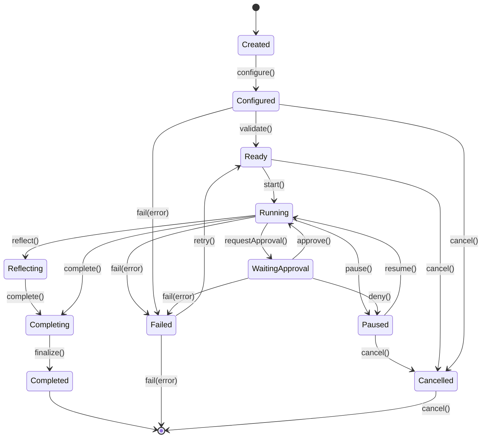

> **Status: CANONICAL** for agent lifecycle states and transitions.
> This document owns the formal agent state machine: IDLE, THINKING, EXECUTING, WAITING, ERROR, TERMINATED.
> It does NOT own the agent runtime loop (see [../architecture/AGENT_RUNTIME.md](../architecture/AGENT_RUNTIME.md)).
>
> Depends on: [../architecture/AGENT_RUNTIME.md](../architecture/AGENT_RUNTIME.md).
> Referenced by: [../models/Agent.md](../models/Agent.md), [../docs/api/Agent-API.md](../docs/api/Agent-API.md).

# Agent Lifecycle State Machine

> Back to [PROJECT_SPECIFICATION.md](../PROJECT_SPECIFICATION.md)

The Agent Lifecycle governs the runtime state of every autonomous agent instance in Nexora. From creation through execution to termination, each agent follows a strict progression ensuring that agents are properly configured before execution and can safely recover from failures or user interventions.

## States

| State | Description |
|-------|-------------|
| **Created** | Agent instance allocated; no configuration applied. |
| **Configured** | System prompt, model binding, tools, and constraints set. |
| **Ready** | All prerequisites validated; awaiting execution signal. |
| **Running** | Actively executing a task loop (plan → act → observe). |
| **Paused** | Execution suspended by user or system policy. Resumable. |
| **WaitingApproval** | Blocked on a human-in-the-loop approval gate. |
| **Reflecting** | Performing self-evaluation or plan revision. |
| **Completing** | Finalizing results, persisting artifacts, releasing resources. |
| **Completed** | Terminal state — agent finished successfully. |
| **Failed** | Terminal state — unrecoverable error encountered. |
| **Cancelled** | Terminal state — explicitly cancelled by user or system. |

## Transitions

| Trigger | From | To | Guard |
|---------|------|----|-------|
| `configure()` | Created | Configured | Required fields non-null |
| `start()` | Ready | Running | Agent not disabled |
| `pause()` | Running | Paused | — |
| `resume()` | Paused | Running | — |
| `requestApproval()` | Running | WaitingApproval | Action exceeds autonomy level |
| `approve()` | WaitingApproval | Running | — |
| `deny()` | WaitingApproval | Paused | — |
| `reflect()` | Running | Reflecting | Reflection policy enabled |
| `complete()` | Reflecting / Running | Completing | — |
| `fail(error)` | * | Failed | Non-recoverable exception |
| `cancel()` | * | Cancelled | — |
| `retry()` | Failed | Ready | Max retries not exceeded |

### Invalid Transitions

- **Created → Running** — agent must be configured first.
- **Completed → Running** — terminal state; use a new instance or restart flow.
- **Cancelled → Running** — terminal state; create a fresh agent.
- **Configured → Reflecting** — agent must reach Running first.

## State Diagram

## Implementation Notes

The lifecycle is enforced by `AgentStateMachine` in the core module. Every state transition fires an `AgentStateEvent` onto the shared event bus, enabling logging, metrics, and UI reactivity. Guards are evaluated synchronously on the caller thread; async validation should complete before invoking the trigger.
