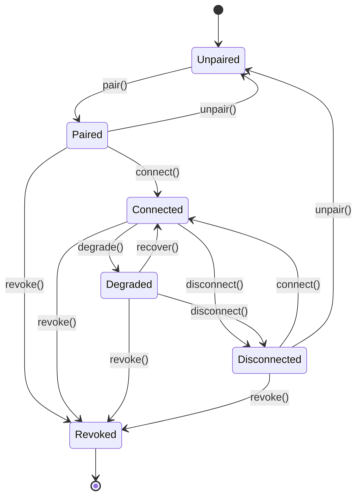

# Instance & Pipe Lifecycle State Machine

> **Status: CANONICAL** for remote-instance pairing and pipe connection states and transitions.
> This document owns the formal state machine for peer instance trust (pairing) and pipe
> connectivity: Unpaired, Paired, Connected, Degraded, Disconnected, Revoked.
> It does NOT own pipe transport or delegation semantics (see
> [../specs/PIPES.md](../specs/PIPES.md)) or intra-workspace agent delegation (see
> [../architecture/MULTI_AGENT_SYSTEM.md](../architecture/MULTI_AGENT_SYSTEM.md)).
>
> Depends on: [../specs/PIPES.md](../specs/PIPES.md).
> Referenced by: [../models/Instance.md](../models/Instance.md), [../docs/CANONICAL_SOURCES.md](../docs/CANONICAL_SOURCES.md).

# Instance & Pipe Lifecycle State Machine — Nexora

> Back to [PROJECT_SPECIFICATION.md](../PROJECT_SPECIFICATION.md)

The Instance & Pipe Lifecycle governs the trust relationship (pairing) and the live
connection (pipe) between the local Nexora instance and a remote peer instance. It is
the authority for pipe availability; delegated tasks riding a pipe keep their own
canonical lifecycle in [TaskLifecycle.md](TaskLifecycle.md) and MUST NOT replace or
extend these states.

## States

| State | Description |
|-------|-------------|
| **Unpaired** | Peer discovered (or manually added) but not trusted; no pipe may open. |
| **Paired** | Fingerprint confirmed by the user on both ends; trusted but not connected. |
| **Connected** | Pipe open (mTLS handshake complete); delegation and broadcast allowed. |
| **Degraded** | Pipe open but failing health checks (missed heartbeats, latency); delegation paused, reconnect in progress. |
| **Disconnected** | Pipe closed (cleanly or by timeout); pairing retained; reconnectable. |
| **Revoked** | Terminal state — pairing destroyed by the user or by security policy; re-pairing required. |

## Durable Status vs. Transport Health

`InstancePairingStatus` is durable and persisted (trust record). Pipe connectivity
(`Connected`/`Degraded`/`Disconnected`) is a session-scoped projection of the transport;
on process death all pipes degrade to `Disconnected` while pairings persist unchanged.
A pipe MUST NOT transition to `Connected` unless the pairing is `Paired` (guard).

### Compatibility Rules

| Pairing/Pipe State | Allowed activity |
|---|---|
| **Unpaired** | Discovery display, pairing prompt only; zero payload exchange |
| **Paired** | Pipe connect/handshake; no delegation yet |
| **Connected** | `pipe_delegate`, `pipe_broadcast`, heartbeats, task payloads |
| **Degraded** | Heartbeats + reconnect only; in-flight tasks checkpoint; no new delegations |
| **Disconnected** | Reconnect attempts (bounded); no payloads |
| **Revoked** | None; all pipes closed; credentials/fingerprints purged |

## Transitions

| Trigger | From | To | Guard |
|---------|------|----|-------|
| `pair()` | Unpaired | Paired | Fingerprint confirmed both ends |
| `connect()` | Paired / Disconnected | Connected | mTLS handshake OK && `minContractVersion` compatible |
| `degrade()` | Connected | Degraded | ≥3 missed heartbeats or latency threshold |
| `recover()` | Degraded | Connected | Heartbeat healthy again |
| `disconnect()` | Connected / Degraded | Disconnected | Clean close or timeout window elapsed |
| `revoke()` | Paired / Connected / Degraded / Disconnected | Revoked | User action or security policy (3 forged-payload violations) |
| `unpair()` | Paired / Disconnected | Unpaired | Administrative reset (rare) |

### Invalid Transitions

- **Unpaired → Connected** — must pair first (fingerprint confirmation is mandatory).
- **Revoked → Paired / Connected** — terminal; a fresh `pair()` cycle is required.
- **Degraded → (new delegation)** — not a state transition but a hard guard: new `DelegateTask` payloads are refused while `Degraded`.

## State Diagram

## Normative Transition Contract

Every transition in this state machine MUST be treated as an atomic command. The
implementation MUST evaluate the guard against the current persisted version, apply the
state change and side effects in one transaction, persist the resulting version, and
emit the event only after durable persistence succeeds.

| Contract field | Requirement |
|---|---|
| Source and trigger | The trigger MUST be valid for the current state; unsupported triggers are rejected without mutation. |
| Guard | Guards are evaluated before mutation using current durable state and required sandbox/security context. |
| Target | The target is the only legal resulting state for the accepted trigger. |
| Side effects | mTLS handshake/teardown, heartbeat scheduler start/stop, in-flight delegation checkpoint, audit record. |
| Persistence | Durable state, transition version, actor, timestamp, correlation ID, and error context MUST be written before the event is published. |
| Event | One semantic transition event is emitted after commit; retries MUST NOT duplicate the committed transition event. |
| Idempotency | Repeating the same command with the same idempotency key returns the committed result; a conflicting version is rejected. |
| Failure | Guard failure and invalid transition return a canonical error and leave state unchanged. Side-effect failure MUST use the subsystem rollback or recovery rule. |
| Recovery | On restart, persisted pairing state and transition version are authoritative; pipes re-derive to `Disconnected` and reconnect per [../specs/PIPES.md](../specs/PIPES.md) §9. |

### Transition Event Minimum

Each emitted lifecycle event MUST carry: `entityId`, `entityType`, `fromState`,
`toState`, `trigger`, `transitionVersion`, `occurredAt`, `actor`, `correlationId`,
and optional canonical error information. Consumers MUST treat events as at-least-once
and deduplicate by `(entityType, entityId, transitionVersion)`.

### Invalid Transition Contract

An invalid transition MUST return a canonical error without changing persisted state,
emitting a success event, or executing target-state side effects. The error MUST identify
current state, requested trigger, entity ID, and correlation ID in redacted structured
details.

## Implementation Notes

Enforced by `PipeStateMachine` in the runtime module. Every transition fires a
`PipeStateEvent` on the event bus. Discovery, pairing UI, and transport are owned by
[../specs/PIPES.md](../specs/PIPES.md); this file owns only pairing/pipe state.
