> **Status: CANONICAL** for memory lifecycle states and transitions.
> This document owns the formal memory state machine: Recorded, Indexed, Retrieved,
> Retained, Expired, Deleted.
> It does NOT own the memory system architecture or storage (see
> [../architecture/MEMORY_SYSTEM.md](../architecture/MEMORY_SYSTEM.md)).
>
> Depends on: [../architecture/MEMORY_SYSTEM.md](../architecture/MEMORY_SYSTEM.md).
> Referenced by: [../lifecycle/MemoryLifecycle.md](../lifecycle/MemoryLifecycle.md),
> [../models/Memory.md](../models/Memory.md).

# Memory Lifecycle State Machine

> Back to [PROJECT_SPECIFICATION.md](../PROJECT_SPECIFICATION.md)

The Memory Lifecycle governs the durable handling, retention, and eviction of memory
records in Nexora. It is the authority for memory *state*; scoring, ranking, and context
projection are derived behaviors that must not replace this state.

## States

| State | Description |
|-------|-------------|
| **Recorded** | Memory written; not yet indexed. |
| **Indexed** | Embedding/vector + search-index updated; retrievable. |
| **Retrieved** | Surfaced into a context/recall segment (read-only state marker). |
| **Retained** | Durable and within retention policy. |
| **Expired** | Retention/lifetime reached; non-revivable and pending eviction. |
| **Deleted** | Terminal state — removed from storage. |

## Durable Status vs. Derived Behavior

`MemoryStatus` is durable and persisted. Retrieval/scoring/ranking are derived
projections at read-time and do not change durable state (except the `Retrieved` marker
for observability/replay).

### Compatibility & Storage Mapping

| Memory State | Storage / Search behavior |
|---|---|
| **RECORDED** | Written to store; not yet in vector index. |
| **INDEXED** | In vector + FTS index; searchable. |
| **RETRIEVED** | Read into a context segment; marked for audit/replay. |
| **RETAINED** | Durable, in-policy; eligible for long-term memory. |
| **EXPIRED** | LRU/retention evicted; non-revivable, no longer searchable, and pending physical delete. |
| **DELETED** | Removed; not retrievable. |

## Transitions

| Trigger | From | To | Guard |
|---------|------|----|-------|
| `record()` | — | Recorded | Valid content + scope |
| `index()` | Recorded | Indexed | Embedding/vector generated |
| `retrieve()` | Indexed / Retained | Retrieved | Search match |
| `retain()` | Indexed / Retrieved | Retained | Retention policy allows |
| `expire()` | Retained | Expired | Lifetime/quota reached |
| `delete()` | Recorded / Indexed / Retrieved / Expired | Deleted | Explicit or policy eviction |
| `reindex()` | Retrieved | Indexed | Content changed |

### Invalid Transitions

- **Recorded → Retrieved** — must be indexed first.
- **Deleted → * (any)** — terminal; new record required.
- **Expired → Indexed** — expired records are non-revivable and cannot be reindexed or become searchable again.
- **Indexed → Retained without retrieval** — allowed (retain directly from indexed).

## State Diagram

```mermaid
stateDiagram-v2
    [*] --> Recorded
    Recorded --> Indexed : index()
    Indexed --> Retrieved : retrieve()
    Indexed --> Retained : retain()
    Retrieved --> Retained : retain()
    Retrieved --> Indexed : reindex()
    Retained --> Expired : expire()
    note right of Expired : Non-revivable; no reindex()
    Expired --> Deleted : delete()
    Recorded --> Deleted : delete()
    Indexed --> Deleted : delete()
    Retrieved --> Deleted : delete()
    Deleted --> [*]
```

## Normative Transition Contract

Every transition in this state machine MUST be treated as an atomic command. The
implementation MUST evaluate the guard against the current persisted version, apply the
state change and side effects in one transaction, persist the resulting version, and
emit the event only after durable persistence succeeds.

| Contract field | Requirement |
|---|---|
| Source and trigger | The trigger MUST be valid for the current state; unsupported triggers are rejected without mutation. |
| Guard | Guards are evaluated before mutation using current durable state and required authorization/context. |
| Target | The target is the only legal resulting state for the accepted trigger. |
| Side effects | Vector/FTS index write, eviction, storage delete, audit record. |
| Persistence | Durable state, transition version, actor, timestamp, correlation ID, and error context MUST be written before the event is published. |
| Event | One semantic transition event is emitted after commit; retries MUST NOT duplicate the committed transition event. |
| Idempotency | Repeating the same command with the same idempotency key returns the committed result; a conflicting version is rejected. |
| Failure | Guard failure and invalid transition return a canonical error and leave state unchanged. Side-effect failure MUST use the subsystem rollback or recovery rule. |
| Recovery | On restart, persisted state and transition version are authoritative; `RETAINED`/`EXPIRED` revalidated against current policy. |

### Transition Event Minimum

Each emitted lifecycle event MUST carry: `entityId`, `entityType`, `fromState`,
`toState`, `trigger`, `transitionVersion`, `occurredAt`, `actor`, `correlationId`,
and optional canonical error information. Consumers MUST treat events as at-least-once
and deduplicate by `(entityType, entityId, transitionVersion)`.

### Invalid Transition Contract

An invalid transition MUST return a canonical error without changing persisted state,
emitting a success event, or executing target-state side effects. The error MUST identify
current state, requested trigger, entity ID, and correlation ID in redacted structured
details.

## Implementation Notes

Enforced by `MemoryStateMachine` in the runtime module. Every transition fires a
`MemoryStateEvent` on the event bus. Vector/FTS indexing and storage are owned by
[../architecture/MEMORY_SYSTEM.md](../architecture/MEMORY_SYSTEM.md); this file owns only
memory state.
