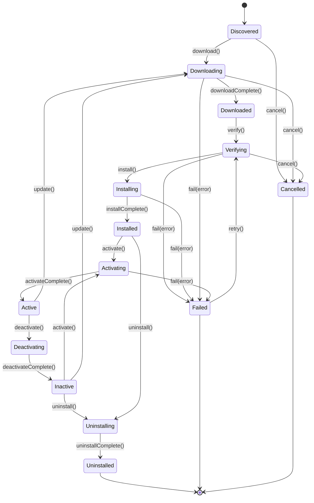

> **Status: CANONICAL** for plugin lifecycle states and transitions.
> This document owns the formal plugin state machine. It does NOT own plugin
> subsystem architecture (see [../architecture/PLUGIN_SYSTEM.md](../architecture/PLUGIN_SYSTEM.md))
> or plugin identity (see [../registry/PLUGINS.md](../registry/PLUGINS.md)).
>
> Depends on: [../architecture/PLUGIN_SYSTEM.md](../architecture/PLUGIN_SYSTEM.md).
> Referenced by: [../registry/PLUGINS.md](../registry/PLUGINS.md).

# Plugin Lifecycle State Machine

> Back to [PROJECT_SPECIFICATION.md](../PROJECT_SPECIFICATION.md)

Nexora's plugin system follows a rigorous lifecycle to ensure that third-party or user-authored extensions are safely discovered, verified, and activated. Each plugin progresses through download, cryptographic verification, installation, and activation stages — with clear recovery paths for failures and support for reactivation without re-installation.

## States

| State | Description |
|-------|-------------|
| **Discovered** | Plugin metadata retrieved from registry or manifest. |
| **Downloading** | Plugin artifact being fetched from the source. |
| **Downloaded** | Artifact on disk; not yet integrity-checked. |
| **Verifying** | Cryptographic signature and compatibility check in progress. |
| **Installing** | Plugin DEX/resources being merged into the app classloader. |
| **Installed** | Plugin available on device but not loaded into runtime. |
| **Activating** | Plugin classloader initializing; entry point being invoked. |
| **Active** | Plugin fully operational; tools/actions registered. |
| **Deactivating** | Plugin teardown in progress; resources releasing. |
| **Inactive** | Plugin installed but not loaded; can be reactivated. |
| **Uninstalling** | Plugin artifacts being removed from device. |
| **Uninstalled** | Terminal state — plugin fully removed. |
| **Failed** | Terminal or recoverable state — operation error occurred. |

## Transitions

| Trigger | From | To | Guard |
|---------|------|----|-------|
| `discover()` | [*] | Discovered | Registry reachable |
| `download()` | Discovered | Downloading | — |
| `verify()` | Downloaded | Verifying | — |
| `install()` | Verifying | Installing | Signature valid && SDK compatible |
| `activate()` | Installed / Inactive | Activating | — |
| `deactivate()` | Active | Deactivating | — |
| `uninstall()` | Installed / Inactive | Uninstalling | — |
| `update()` | Active / Inactive | Downloading | New version available |
| `fail(error)` | * | Failed | — |
| `retry()` | Failed | Verifying | Retriable error |

### Recovery Paths

- **Failed → Verifying**: When the failure occurred during download or verification and the error is retriable (e.g., network timeout).
- **Inactive → Activating**: Reactivation skips download and install; uses cached artifacts.
- **Active → Downloading** (via `update()`): In-place update preserves plugin state where possible.

## State Diagram

## Implementation Notes

The `PluginManager` service coordinates lifecycle transitions on a dedicated dispatcher. Download and verification run in an IO-scoped coroutine with configurable timeouts. Plugin artifacts are stored under `files_dir/plugins/{id}/{version}/` and isolated via a per-plugin `DexClassLoader`. The `PluginRegistry` maintains a map of active plugin instances and is the source of truth for tool/action discovery. Signature verification uses the Android `PackageManager` APIs for APK-signed plugins or JWK-based verification for script plugins.
