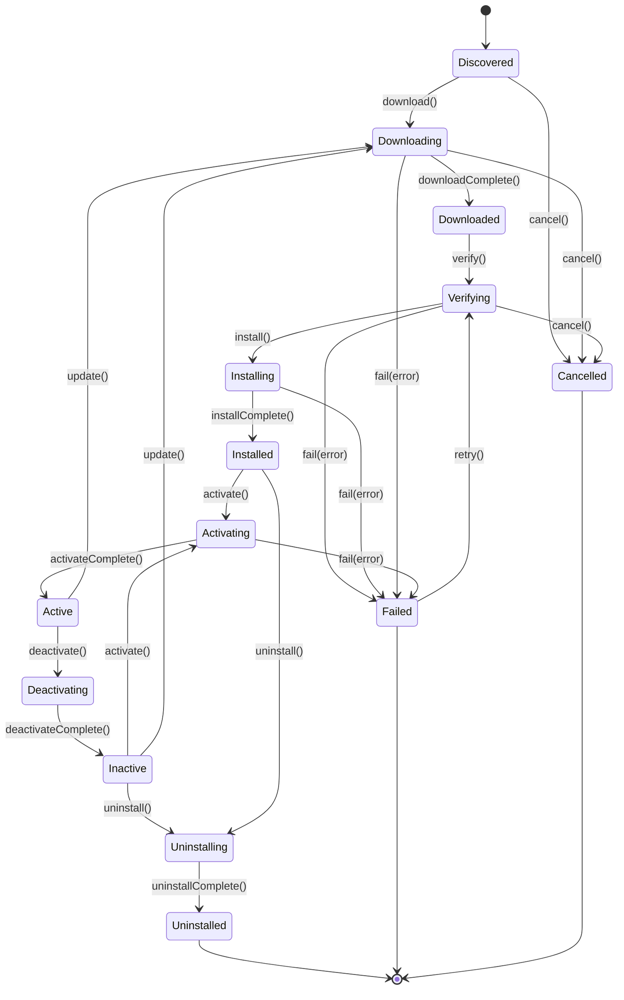

> **Status: CANONICAL** for plugin lifecycle states and transitions.
> This document owns the formal plugin state machine. It does NOT own plugin
> subsystem architecture (see [../architecture/PLUGIN_SYSTEM.md](../architecture/PLUGIN_SYSTEM.md))
> or plugin identity (see [../registry/PLUGINS.md](../registry/PLUGINS.md)).
>
> Depends on: [../architecture/PLUGIN_SYSTEM.md](../architecture/PLUGIN_SYSTEM.md).
> Referenced by: [../registry/PLUGINS.md](../registry/PLUGINS.md).

# Plugin Lifecycle State Machine

> Back to [PROJECT_SPECIFICATION.md](../PROJECT_SPECIFICATION.md)

Nexora's plugin system follows a rigorous lifecycle to ensure that third-party or user-authored extensions are safely discovered, verified, and activated. Each plugin progresses through download, cryptographic verification, installation, and activation stages — with clear recovery paths for failures and support for reactivation without re-installation.

## States

| State | Description |
|-------|-------------|
| **Discovered** | Plugin metadata retrieved from registry or manifest. |
| **Downloading** | Plugin artifact being fetched from the source. |
| **Downloaded** | Artifact on disk; not yet integrity-checked. |
| **Verifying** | Cryptographic signature and compatibility check in progress. |
| **Installing** | Plugin DEX/resources being merged into the app classloader. |
| **Installed** | Plugin available on device but not loaded into runtime. |
| **Activating** | Plugin classloader initializing; entry point being invoked. |
| **Active** | Plugin fully operational; tools/actions registered. |
| **Deactivating** | Plugin teardown in progress; resources releasing. |
| **Inactive** | Plugin installed but not loaded; can be reactivated. |
| **Uninstalling** | Plugin artifacts being removed from device. |
| **Uninstalled** | Terminal state — plugin fully removed. |
| **Failed** | Terminal or recoverable state — operation error occurred. |
| **Cancelled** | Terminal state — download/verify flow aborted by user or coordinator before completion. |

## Transitions

| Trigger | From | To | Guard |
|---------|------|----|-------|
| `discover()` | [*] | Discovered | Registry reachable |
| `download()` | Discovered | Downloading | — |
| `downloadComplete()` | Downloading | Downloaded | — |
| `verify()` | Downloaded | Verifying | — |
| `install()` | Verifying | Installing | Signature valid && SDK compatible |
| `installComplete()` | Installing | Installed | — |
| `activate()` | Installed / Inactive | Activating | — |
| `activateComplete()` | Activating | Active | — |
| `deactivate()` | Active | Deactivating | — |
| `deactivateComplete()` | Deactivating | Inactive | — |
| `uninstall()` | Installed / Inactive | Uninstalling | — |
| `uninstallComplete()` | Uninstalling | Uninstalled | — |
| `update()` | Active / Inactive | Downloading | New version available |
| `cancel()` | Discovered / Downloading / Verifying | Cancelled | — |
| `fail(error)` | * | Failed | — |
| `retry()` | Failed | Verifying | Retriable error |

### Recovery Paths

- **Failed → Verifying**: When the failure occurred during download or verification and the error is retriable (e.g., network timeout).
- **Inactive → Activating**: Reactivation skips download and install; uses cached artifacts.
- **Active → Downloading** (via `update()`): In-place update preserves plugin state where possible.

## State Diagram

## Normative Transition Contract

Every transition in this state machine MUST be treated as an atomic command. The implementation MUST evaluate the guard against the current persisted version, apply the state change and side effects in one transaction, persist the resulting version, and emit the event only after durable persistence succeeds.

| Contract field | Requirement |
|---|---|
| Source and trigger | The trigger MUST be valid for the current state; unsupported triggers are rejected without mutation. |
| Guard | Guards are evaluated before mutation using current durable state and required authorization/context. |
| Target | The target is the only legal resulting state for the accepted trigger. |
| Side effects | Resource allocation/release, checkpointing, cleanup, routing, or child-operation changes MUST be listed by the owning subsystem. |
| Persistence | Durable state, transition version, actor, timestamp, correlation ID, and error context MUST be written before the event is published. |
| Event | One semantic transition event is emitted after commit; retries MUST NOT duplicate the committed transition event. |
| Idempotency | Repeating the same command with the same idempotency key returns the committed result; a conflicting version is rejected. |
| Failure | Guard failure and invalid transition return a canonical error and leave state unchanged. Side-effect failure MUST use the subsystem rollback or recovery rule. |
| Recovery | On restart, persisted state and transition version are authoritative; incomplete work resumes only through an explicitly listed recovery transition. |

### Transition Event Minimum

Each emitted lifecycle event MUST carry: `entityId`, `entityType`, `fromState`, `toState`, `trigger`, `transitionVersion`, `occurredAt`, `actor`, `correlationId`, and optional canonical error information. Consumers MUST treat events as at-least-once and deduplicate by `(entityType, entityId, transitionVersion)`.

### Invalid Transition Contract

An invalid transition MUST return a canonical error without changing persisted state, emitting a success event, or executing target-state side effects. The error MUST identify current state, requested trigger, entity ID, and correlation ID in redacted structured details.

## Implementation Notes

The `PluginManager` service coordinates lifecycle transitions on a dedicated dispatcher. Download and verification run in an IO-scoped coroutine with configurable timeouts. Plugin artifacts are stored under `files_dir/plugins/{id}/{version}/` and isolated via a per-plugin `DexClassLoader`. The `PluginRegistry` maintains a map of active plugin instances and is the source of truth for tool/action discovery. Signature verification uses the Android `PackageManager` APIs for APK-signed plugins or JWK-based verification for script plugins.
