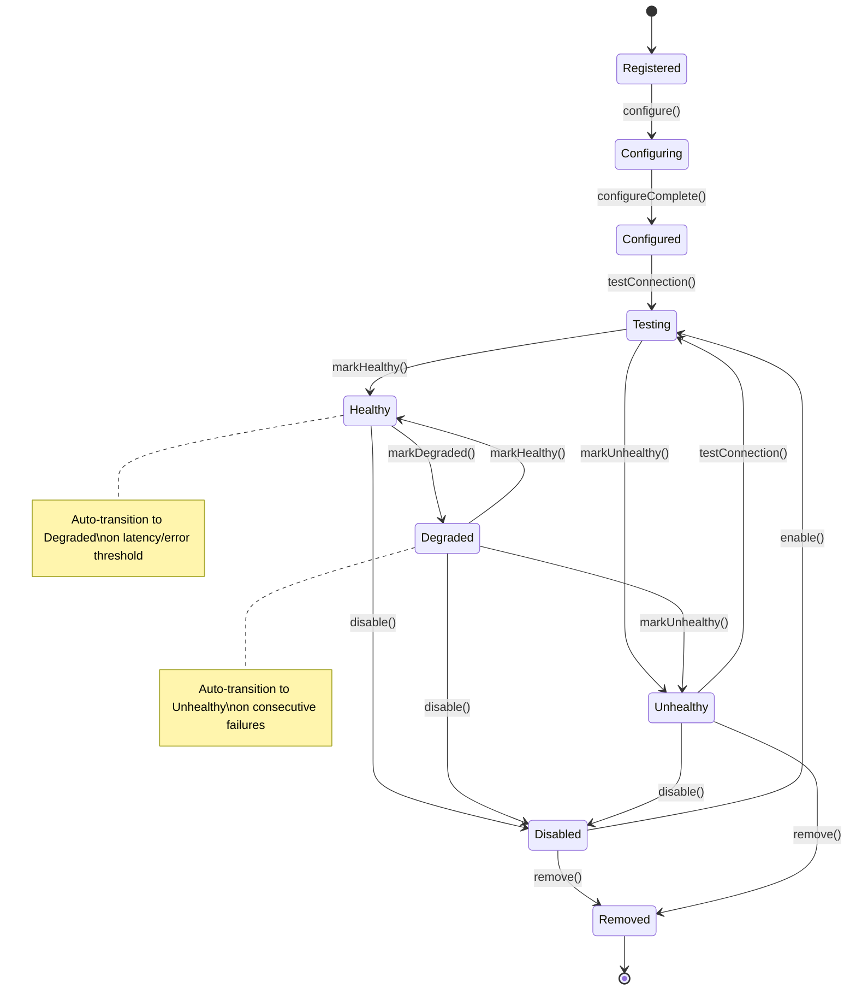

> **Status: CANONICAL** for provider lifecycle states, health checks, failover, and routing eligibility.
> This document owns the formal state machine for provider lifecycle:
> health state, failover state, disablement, and routing eligibility.
> It does NOT own provider subsystem architecture (see
> [../architecture/PROVIDER_SYSTEM.md](../architecture/PROVIDER_SYSTEM.md)).
>
> Depends on: [../architecture/PROVIDER_SYSTEM.md](../architecture/PROVIDER_SYSTEM.md).
> Referenced by: [../models/Provider.md](../models/Provider.md), [../protocols/Provider-Protocol.md](../protocols/Provider-Protocol.md).

# Provider Lifecycle State Machine

> Back to [PROJECT_SPECIFICATION.md](../PROJECT_SPECIFICATION.md)

A **Provider** in Nexora represents an external AI model endpoint (OpenAI, Anthropic, local Ollama, etc.) that agents use for inference. The Provider Lifecycle manages registration, configuration, health monitoring, and automatic failover — ensuring agents always route requests to a functional backend.

## States

| State | Description |
|-------|-------------|
| **Registered** | Provider record created with endpoint URL and credentials. |
| **Configuring** | Applying model parameters, rate limits, and token budgets. |
| **Configured** | Static configuration complete; not yet tested. |
| **Testing** | Probe request sent to validate connectivity and model access. |
| **Healthy** | Provider passing health checks; eligible for request routing. |
| **Degraded** | Elevated latency or intermittent errors; still routable with caution. |
| **Unhealthy** | Consistently failing health checks; excluded from routing. |
| **Disabled** | Manually disabled by user; excluded from routing and health checks. |
| **Removed** | Terminal state — provider record deleted. |

## Transitions

| Trigger | From | To | Guard |
|---------|------|----|-------|
| `register()` | [*] | Registered | Endpoint URL valid |
| `configure()` | Registered | Configuring | — |
| `testConnection()` | Configured | Testing | — |
| `markHealthy()` | Testing / Degraded | Healthy | Response < latency threshold |
| `markDegraded()` | Healthy | Degraded | Latency > warn threshold or error rate > 5% |
| `markUnhealthy()` | Degraded | Unhealthy | Consecutive failures >= 3 |
| `disable()` | Healthy / Degraded / Unhealthy | Disabled | — |
| `enable()` | Disabled | Testing | Re-probe before re-enabling |
| `remove()` | Disabled / Unhealthy | Removed | No active agent sessions depend on it |

### Auto-Transitions (Health Monitor)

The `HealthMonitor` coroutine runs periodic probes (configurable interval, default 30s) against every non-Disabled provider. It drives the **Healthy → Degraded → Unhealthy** degradation chain based on observed metrics:

- **Degraded**: P95 latency exceeds `warnLatencyMs` or error rate exceeds 5% over the rolling window.
- **Unhealthy**: Three consecutive probe failures or error rate exceeds 20%.

On **Unhealthy**, the `ProviderRouter` automatically excludes the provider and selects the next highest-priority Healthy provider. If no Healthy provider remains, the router falls back to the highest-priority Degraded provider and emits a `ProviderFallbackWarning` event.

## State Diagram

## Normative Transition Contract

Every transition in this state machine MUST be treated as an atomic command. The implementation MUST evaluate the guard against the current persisted version, apply the state change and side effects in one transaction, persist the resulting version, and emit the event only after durable persistence succeeds.

| Contract field | Requirement |
|---|---|
| Source and trigger | The trigger MUST be valid for the current state; unsupported triggers are rejected without mutation. |
| Guard | Guards are evaluated before mutation using current durable state and required authorization/context. |
| Target | The target is the only legal resulting state for the accepted trigger. |
| Side effects | Resource allocation/release, checkpointing, cleanup, routing, or child-operation changes MUST be listed by the owning subsystem. |
| Persistence | Durable state, transition version, actor, timestamp, correlation ID, and error context MUST be written before the event is published. |
| Event | One semantic transition event is emitted after commit; retries MUST NOT duplicate the committed transition event. |
| Idempotency | Repeating the same command with the same idempotency key returns the committed result; a conflicting version is rejected. |
| Failure | Guard failure and invalid transition return a canonical error and leave state unchanged. Side-effect failure MUST use the subsystem rollback or recovery rule. |
| Recovery | On restart, persisted state and transition version are authoritative; incomplete work resumes only through an explicitly listed recovery transition. |

### Transition Event Minimum

Each emitted lifecycle event MUST carry: `entityId`, `entityType`, `fromState`, `toState`, `trigger`, `transitionVersion`, `occurredAt`, `actor`, `correlationId`, and optional canonical error information. Consumers MUST treat events as at-least-once and deduplicate by `(entityType, entityId, transitionVersion)`.

### Invalid Transition Contract

An invalid transition MUST return a canonical error without changing persisted state, emitting a success event, or executing target-state side effects. The error MUST identify current state, requested trigger, entity ID, and correlation ID in redacted structured details.

## Implementation Notes

Provider state is managed by the `ProviderRegistry` singleton, which persists configuration to the Room `provider` table and maintains an in-memory `ProviderStatusMap` for fast routing lookups. The `HealthMonitor` runs as a `CoroutineScope` with a `FixedDelayRouter` — it batches probe requests and updates statuses atomically. The `ProviderRouter` implements a priority-based selection strategy with automatic fallback, emitting `ProviderRouted` and `ProviderFallbackWarning` events to the shared bus for observability.