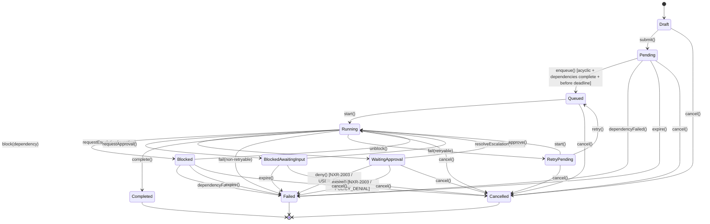

# Task Lifecycle State Machine

> **Status: CANONICAL.** This document is the single authoritative source for Task
> states and transitions across Nexora. Every other document (domain model, runtime,
> API, SDK, protocol, lifecycle narrative, diagrams, tests) MUST reference the
> `TaskStatus` enum defined here and MUST NOT redefine, rename, or subset it.
>
> Depends on: none (root of the Task-state hierarchy).
> Referenced by: [../models/Task.md](../models/Task.md), [../architecture/RUNTIME.md](../architecture/RUNTIME.md), [../docs/LIFECYCLES.md](../docs/LIFECYCLES.md), [../specs/EXECUTION_LIFECYCLE.md](../specs/EXECUTION_LIFECYCLE.md), [../docs/api/Runtime-API.md](../docs/api/Runtime-API.md).

> Back to [PROJECT_SPECIFICATION.md](../PROJECT_SPECIFICATION.md)

A **Task** is the fundamental unit of work assigned to an agent in Nexora. The Task Lifecycle tracks each task from initial authoring through execution to final resolution, supporting blocking on dependencies, human approval gates, and retry semantics for transient failures.

## States

| State | Description |
|-------|-------------|
| **Draft** | Task defined locally; not yet submitted to the task manager. |
| **Pending** | Submitted; awaiting dependency resolution before enqueue. |
| **Queued** | Dependencies satisfied; placed in the agent's execution queue. |
| **Running** | Agent is actively executing the task. |
| **Blocked** | Execution stalled due to an unresolved dependency or resource lock. |
| **BlockedAwaitingInput** | Stalled due to loop escalation or missing capability; awaiting user clarification/input. |
| **WaitingApproval** | Task produced an action requiring human approval. |
| **Completed** | Terminal state — task finished successfully. |
| **Failed** | Terminal state — non-retryable failure. |
| **Cancelled** | Terminal state — cancelled by user or parent workflow. |
| **RetryPending** | Failure was retryable; queued for re-execution after backoff. |

> **DEC-7:** RetryPending is **EPHEMERAL** and does not survive process death. Process-death recovery is a separate reconciliation path: eligible durable R4 evidence yields `RetryPending → Queued` while preserving the existing Execution identity. It is not ordinary retry, does not restore the previous RetryPending deadline, and does not resume a checkpoint. See [DEC-7](../decisions/DEC-7-retry-attempt-state.md) §DEC-7.7–DEC-7.12.

## Transitions

| Trigger | From | To | Guard |
|---------|------|----|-------|
| `submit()` | Draft | Pending | Task schema valid |
| `enqueue()` | Pending | Queued | Dependency references are valid, dependency graph is acyclic, and all dependencies completed; effective deadline has not expired; invalid references/cycles reject with `NXR-1014` and leave the Task unchanged |
| `start()` | Queued / RetryPending | Running | Agent available; when the source is `RetryPending`, the existing retry backoff has elapsed and the TaskScheduler authorizes the start. |
| `block(dependency)` | Running | Blocked | Dependency not yet completed |
| `unblock()` | Blocked | Running | Dependency resolved |
| `dependencyFailed()` | Pending / Blocked | Failed | A required dependency entered terminal `Failed` or `Cancelled` state; `NXR-1015` / `Server` |
| `requestEscalation(question)` | Running | BlockedAwaitingInput | Loop escalation triggered or capability gap identified |
| `resolveEscalation(answer)` | BlockedAwaitingInput | Running | User input received; resumes from checkpoint |
| `requestApproval()` | Running | WaitingApproval | Action exceeds autonomy scope |
| `approve()` | WaitingApproval | Running | — |
| `deny()` | WaitingApproval | Failed | User denial; canonical `NXR-2003` / `USER_DENIED`; no task mutation beyond the terminal failure |
| `complete()` | Running | Completed | Result validated |
| `fail(error)` | Running | Failed | Error is non-retryable |
| `fail(error)` | Running | RetryPending | Error is retryable && retries < max |
| `expire()` | WaitingApproval | Failed | Approval transaction expired; canonical `NXR-2003` / `POLICY_DENIAL`; no automatic approval or retry |
| `expire()` | Pending / Blocked / BlockedAwaitingInput | Failed | Effective deadline reached; `NXR-1016` / `Infrastructure`; no retry unless a separate retryable failure rule applies |
| `cancel()` | * | Cancelled | — |
| `retry()` | RetryPending | Queued | Backoff elapsed |

### DEC-30 Liveness Projections

The Task scheduler validates dependency references and the dependency graph before a task can be queued; invalid references or cycles are rejected with `NXR-1014` / `Client` without lifecycle mutation. A failed dependency propagates `NXR-1015` / `Server` and terminal failure to dependants rather than leaving them indefinitely blocked. Approval denial uses `NXR-2003` / `USER_DENIED`, and approval expiry uses `NXR-2003` / `POLICY_DENIAL`; both terminate the task through `Failed` without automatic retry. `Pending`, `Blocked`, and `BlockedAwaitingInput` are deadline-bounded; expiry transitions to `Failed` with `NXR-1016` / `Infrastructure`. These projections preserve the existing state set and do not redefine `Blocked` or approval semantics beyond the selected triggers.

### DEC-35 Approval Projection

The PermissionModel/Tool boundary owns the authorization result and returns `NXR-2003` with `USER_DENIED` or `POLICY_DENIAL`. The Task remains authoritative for operation outcome: approval denial or expiry commits `WaitingApproval → Failed`, performs no Tool side effect, and does not retry automatically. An Agent participating in the Task may independently transition to `Paused` under DEC-35; that Agent projection does not resume, complete, or change the failed Task.

### Invalid Transitions

- **Draft → Running** — must submit and enqueue first.
- **Completed → Running** — terminal state; create a new task.
- **Queued → Completed** — task must pass through Running.
- **BlockedAwaitingInput → Completed** — task must resolve escalation input and return to Running first.
- **Pending → RetryPending** — task has never attempted execution.

## State Diagram

## Normative Transition Contract

Every transition in this state machine MUST be treated as an atomic command. The implementation MUST evaluate the guard against the current persisted version, apply the state change and side effects in one transaction, persist the resulting version, and emit the event only after durable persistence succeeds.

| Contract field | Requirement |
|---|---|
| Source and trigger | The trigger MUST be valid for the current state; unsupported triggers are rejected without mutation. |
| Guard | Guards are evaluated before mutation using current durable state and required authorization/context. |
| Target | The target is the only legal resulting state for the accepted trigger. |
| Side effects | Resource allocation/release, checkpointing, cleanup, routing, or child-operation changes MUST be listed by the owning subsystem. |
| Persistence | Durable state, transition version, actor, timestamp, correlation ID, and error context MUST be written before the event is published. |
| Event | One semantic transition event is emitted after commit; retries MUST NOT duplicate the committed transition event. |
| Idempotency | Repeating the same command with the same idempotency key returns the committed result; a conflicting version is rejected. |
| Failure | Guard failure and invalid transition return a canonical error and leave state unchanged. Side-effect failure MUST use the subsystem rollback or recovery rule. |
| Recovery | On restart, persisted state and transition version are authoritative; incomplete work resumes only through an explicitly listed recovery transition. |

### Transition Event Minimum

Each emitted lifecycle event MUST carry: `entityId`, `entityType`, `fromState`, `toState`, `trigger`, `transitionVersion`, `occurredAt`, `actor`, `correlationId`, and optional canonical error information. Consumers MUST treat events as at-least-once and deduplicate by `(entityType, entityId, transitionVersion)`.

### Invalid Transition Contract

An invalid transition MUST return a canonical error without changing persisted state, emitting a success event, or executing target-state side effects. The error MUST identify current state, requested trigger, entity ID, and correlation ID in redacted structured details.

## Implementation Notes

Task state is persisted in the local Room database via the `TaskEntity` table. The `TaskScheduler` service drives transitions automatically — it watches dependency completions to trigger `enqueue()` and applies exponential backoff for `RetryPending` tasks. Approval requests surface through the `ApprovalGateway`, which blocks the agent loop until the user responds.

## Upgrade note

This lifecycle participates in bounded-progress execution. Re-entry from retry, recovery, verification, or self-correction must remain bounded by explicit retry/iteration policy defined outside this state machine.
