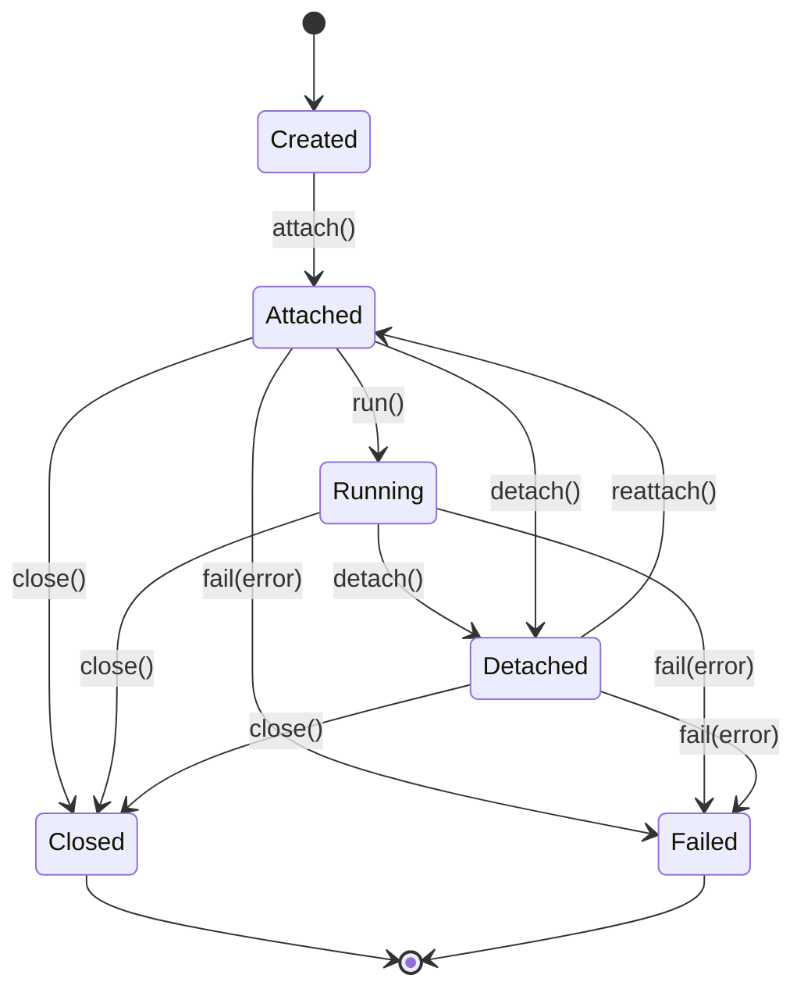

> **Status: CANONICAL** for terminal session lifecycle states and transitions.
> This document owns the formal terminal session state machine: Created, Attached,
> Running, Detached, Closed, Failed.
> It does NOT own terminal execution behavior (see [../specs/TERMINAL.md](../specs/TERMINAL.md))
> or sandbox architecture (see [../architecture/SANDBOX.md](../architecture/SANDBOX.md)).
>
> Depends on: [../specs/TERMINAL.md](../specs/TERMINAL.md).
> Referenced by: [../lifecycle/TerminalSessionLifecycle.md](../lifecycle/TerminalSessionLifecycle.md),
> [../models/TerminalSession.md](../models/TerminalSession.md).

# Terminal Session Lifecycle State Machine

> Back to [PROJECT_SPECIFICATION.md](../PROJECT_SPECIFICATION.md)

The Terminal Session Lifecycle governs the availability and execution state of every
terminal session within a sandboxed workspace. Terminal sessions may attach to a task
or tool-call, but task/tool-call lifecycle remains the authority for business-level
execution outcomes.

## States

| State | Description |
|-------|-------------|
| **Created** | Session allocated; not yet attached to a PTY or subprocess. |
| **Attached** | PTY/spawned process bound; session ready for I/O. |
| **Running** | Actively executing a command or interactive input. |
| **Detached** | PTY/session still alive but disconnected from foreground I/O. |
| **Closed** | Terminal state — session exited cleanly; resources released. |
| **Failed** | Terminal state — unrecoverable error (crash, sandbox violation). |

## Durable Status vs. Containment

`TerminalSessionStatus` is the durable, persisted authority. A terminal session MAY
participate in a correlated task or tool-call execution, but it MUST NOT become the
primary authority for task or execution lifecycle state.

### Compatibility & Resource Rules

| Terminal State | Process state | I/O availability |
|---|---|---|
| **CREATED** | No process; not yet attached. | None. |
| **ATTACHED** | Spawned, waiting for I/O. | Foreground I/O; may receive input. |
| **RUNNING** | Executing command or reading input. | Full I/O. |
| **DETACHED** | Running in background; output continues. | No foreground I/O; output buffered. `suspended` MAY be set when the detach was caused by an interactive timeout rather than an explicit `detach()`. |
| **CLOSED** | Exited; resources released. | None. |
| **FAILED** | Killed or crashed; error details preserved. | None. |

## Transitions

| Trigger | From | To | Guard |
|---------|------|----|-------|
| `attach()` | Created | Attached | PTY or subprocess spawned successfully |
| `run()` | Attached | Running | Command or interactive input accepted |
| `detach()` | Attached / Running | Detached | Process stays alive |
| `reattach()` | Detached | Attached | Process still alive |
| `close()` | Attached / Running / Detached | Closed | Process termination complete |
| `fail(error)` | Attached / Running / Detached | Failed | Unrecoverable error |

### Invalid Transitions

- **Created → Running** — must attach first.
- **Closed / Failed → * (any)** — terminal state; create a new session.
- **Detached → Running** — must reattach first (process is alive but not foreground).

## State Diagram

## Normative Transition Contract

Every transition in this state machine MUST be treated as an atomic command. The
implementation MUST evaluate the guard against the current persisted state, apply the
state change and side effects in one transaction, persist the resulting state, and
emit the event only after durable persistence succeeds.

| Contract field | Requirement |
|---|---|
| Source and trigger | The trigger MUST be valid for the current state; unsupported triggers are rejected without mutation. |
| Guard | Guards are evaluated before mutation using current durable state and required sandbox context. |
| Target | The target is the only legal resulting state for the accepted trigger. |
| Side effects | Process spawn/kill, PTY setup/teardown, resource allocation/release, I/O buffer flush, checkpoint capture. |
| Persistence | Durable state, transition version, actor, timestamp, correlation ID, and error context MUST be written before the event is published. |
| Event | One semantic transition event is emitted after commit; retries MUST NOT duplicate the committed transition event. |
| Idempotency | Repeating the same command with the same idempotency key returns the committed result; a conflicting version is rejected. |
| Failure | Guard failure and invalid transition return a canonical error and leave state unchanged. Side-effect failure MUST use the subsystem rollback or recovery rule. |
| Recovery | On restart, persisted state and transition version are authoritative; incomplete work resumes only through an explicitly listed recovery transition. |

### Transition Event Minimum

Each emitted lifecycle event MUST carry: `entityId`, `entityType`, `fromState`,
`toState`, `trigger`, `transitionVersion`, `occurredAt`, `actor`, `correlationId`,
and optional canonical error information. Consumers MUST treat events as at-least-once
and deduplicate by `(entityType, entityId, transitionVersion)`.

### Invalid Transition Contract

An invalid transition MUST return a canonical error without changing persisted state,
emitting a success event, or executing target-state side effects. The error MUST identify
current state, requested trigger, entity ID, and correlation ID in redacted structured
details.

## Implementation Notes

Enforced by `TerminalSessionStateMachine` in the core module. Every transition fires a
`TerminalSessionStateEvent` on the event bus. Subprocess/PTY management and sandbox
isolation are owned by [../specs/TERMINAL.md](../specs/TERMINAL.md) and
[../architecture/SANDBOX.md](../architecture/SANDBOX.md); this file owns only terminal
session state.