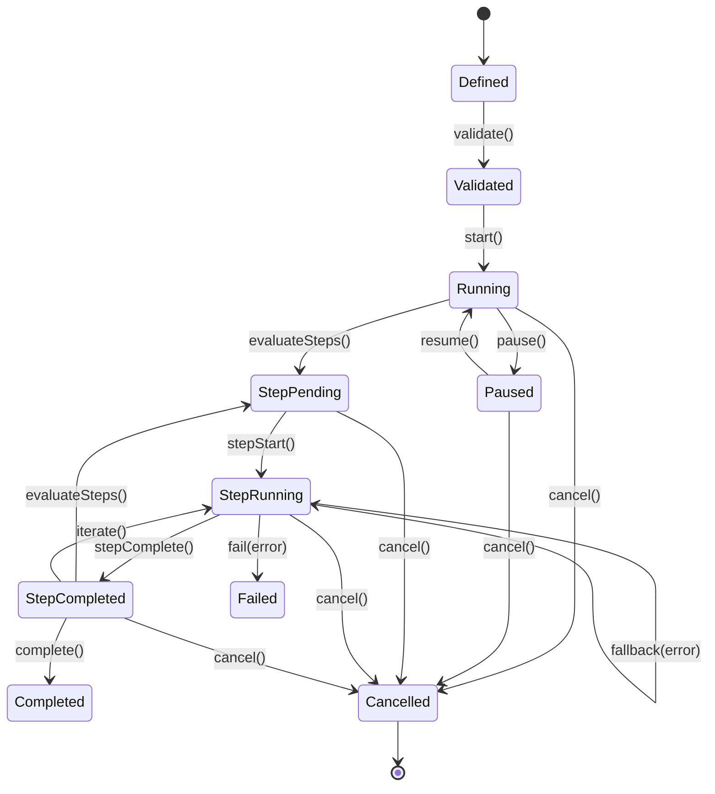

> **Status: CANONICAL** for workflow lifecycle states and transitions.
> This document owns the formal workflow state machine.
> It does NOT own workflow graph progression logic (see [../architecture/WORKFLOW_ENGINE.md](../architecture/WORKFLOW_ENGINE.md)).
>
> Depends on: [../architecture/WORKFLOW_ENGINE.md](../architecture/WORKFLOW_ENGINE.md).
> Referenced by: [../models/Workflow.md](../models/Workflow.md), [../docs/api/Runtime-API.md](../docs/api/Runtime-API.md).

# Workflow Lifecycle State Machine

> Back to [PROJECT_SPECIFICATION.md](../PROJECT_SPECIFICATION.md)

A **Workflow** in Nexora is a step dependency graph that supports bounded cycles for iterative workflows. The workflow-level lifecycle tracks overall progress, while each step maintains its own sub-state internally. Workflows support pause/resume semantics and propagate cancellation across all constituent steps.

## States

| State | Description |
|-------|-------------|
| **Defined** | Workflow graph structure authored; steps and edges declared. |
| **Validated** | Graph has no invalid cycles, all step inputs/outputs type-checked. |
| **Running** | At least one step is actively executing. |
| **Paused** | No steps executing; can be resumed from pause point. |
| **StepPending** | Next step(s) ready to execute but not yet started. |
| **StepRunning** | A step is actively executing within the workflow. |
| **StepCompleted** | A step has finished; downstream evaluation in progress. |
| **Completed** | Terminal state — all steps finished successfully. |
| **Failed** | Terminal state — a step failed with no fallback path. |
| **Cancelled** | Terminal state — user or system cancelled the workflow. |

## Transitions

| Trigger | From | To | Guard |
|---------|------|----|-------|
| `define()` | [*] | Defined | — |
| `validate()` | Defined | Validated | Graph has no invalid cycles |
| `start()` | Validated | Running | — |
| `pause()` | Running | Paused | — |
| `resume()` | Paused | Running | Pending steps exist |
| `evaluateSteps()` | Running | StepPending | — |
| `stepStart()` | StepPending | StepRunning | Upstream steps completed |
| `stepComplete()` | StepRunning | StepCompleted | Step result valid |
| `evaluateSteps()` | StepCompleted | StepPending | Downstream step eligible |
| `complete()` | StepCompleted | Completed | No pending steps remain |
| `fail(error)` | StepRunning | Failed | No error-handler edge |
| `fallback(error)` | StepRunning | StepRunning | FALLBACK edge exists; alternates available |
| `iterate()` | StepCompleted | StepRunning | Iterative step has remaining iterations |
| `cancel()` | * | Cancelled | — |

### Step Sub-States

Each step internally tracks: **Pending → Running → Completed / Failed / Skipped**. The workflow engine evaluates step readiness after every `stepComplete()` by walking the graph for steps whose all upstream dependencies are in the Completed state. Iterative steps re-enter StepRunning until `maxIterations` or `convergenceCondition` is met.

## State Diagram

## Normative Transition Contract

Every transition in this state machine MUST be treated as an atomic command. The implementation MUST evaluate the guard against the current persisted version, apply the state change and side effects in one transaction, persist the resulting version, and emit the event only after durable persistence succeeds.

| Contract field | Requirement |
|---|---|
| Source and trigger | The trigger MUST be valid for the current state; unsupported triggers are rejected without mutation. |
| Guard | Guards are evaluated before mutation using current durable state and required authorization/context. |
| Target | The target is the only legal resulting state for the accepted trigger. |
| Side effects | Resource allocation/release, checkpointing, cleanup, routing, or child-operation changes MUST be listed by the owning subsystem. |
| Persistence | Durable state, transition version, actor, timestamp, correlation ID, and error context MUST be written before the event is published. |
| Event | One semantic transition event is emitted after commit; retries MUST NOT duplicate the committed transition event. |
| Idempotency | Repeating the same command with the same idempotency key returns the committed result; a conflicting version is rejected. |
| Failure | Guard failure and invalid transition return a canonical error and leave state unchanged. Side-effect failure MUST use the subsystem rollback or recovery rule. |
| Recovery | On restart, persisted state and transition version are authoritative; incomplete work resumes only through an explicitly listed recovery transition. |

### Transition Event Minimum

Each emitted lifecycle event MUST carry: `entityId`, `entityType`, `fromState`, `toState`, `trigger`, `transitionVersion`, `occurredAt`, `actor`, `correlationId`, and optional canonical error information. Consumers MUST treat events as at-least-once and deduplicate by `(entityType, entityId, transitionVersion)`.

### Invalid Transition Contract

An invalid transition MUST return a canonical error without changing persisted state, emitting a success event, or executing target-state side effects. The error MUST identify current state, requested trigger, entity ID, and correlation ID in redacted structured details.

## Cross-Layer Contract Boundaries

The Workflow lifecycle owns workflow-level state transitions and step-state progression; it does not replace the existing PermissionModel, TaskLifecycle, Execution lifecycle, Tool System, Provider System, or Android background authorities.

A `WaitForApproval` step uses the existing PermissionModel approval transaction and audit contract. Approval denial and approval expiry use the existing Task/Agent effects and canonical `NXR-2003` mappings; they do not create a new Workflow state, error identity, retry path, or authorization bypass. A step is completed only after the approved operation produces a valid result under its existing acceptance conditions. Resume remains subject to the existing effective deadline, idempotency, cancellation, and checkpoint contracts.

Workflow error strategies select graph behavior only. `RETRY`, `SKIP`, `ABORT`, and `FALLBACK` do not override canonical error identity, Task/Execution lifecycle effects, Tool/Provider retry rules, operation-level idempotency, deadline inheritance, or cancellation propagation. Workflow retry and iteration progress are durable workflow data and must not reset the parent Task retry budget, failure ledger, deadline, or execution lineage.

A step with `UNKNOWN_COMPLETION` remains unresolved until the Tool System reconciliation contract resolves the side effect. The Workflow lifecycle MUST NOT mark it successful, skip it, or replay it solely because a timeout or transport interruption occurred. Recoverable workflow state is checkpointed through the existing execution/checkpoint protocol.

Validation distinguishes invalid dependency cycles from explicitly bounded `Iterative` edges. Unbounded or ambiguous cycles fail validation before execution; bounded iteration uses the existing `maxIterations` and/or `convergenceCondition` fields.

## Implementation Notes

The `WorkflowEngine` class manages the graph traversal and step dispatching. It uses a topological sort to determine execution order (treating iteration edges specially) and maintains an in-memory `StepStatusMap`. Workflow state is persisted to the `workflow` table in Room; step sub-states are stored in the `workflow_step` table. The engine is coroutine-based — each `stepStart()` launches a child job so that independent parallel branches execute concurrently, with structured concurrency ensuring cancellation propagates to all children.
