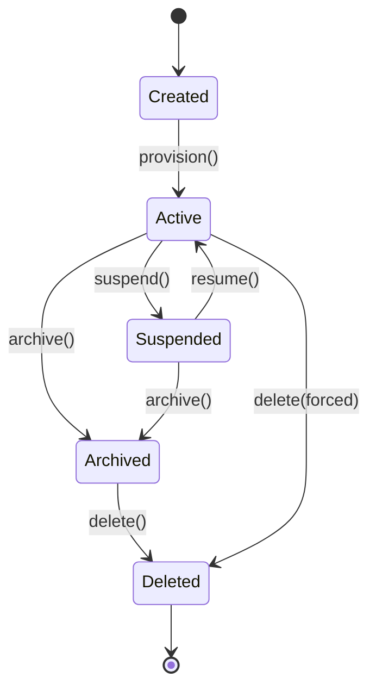

> **Status: CANONICAL** for workspace lifecycle states and transitions.
> This document owns the formal workspace state machine: Created, Active, Suspended,
> Archived, Deleted.
> It does NOT own workspace architecture or sandbox isolation (see
> [../architecture/SANDBOX.md](../architecture/SANDBOX.md)).
>
> Depends on: [../architecture/SANDBOX.md](../architecture/SANDBOX.md).
> Referenced by: [../lifecycle/WorkspaceLifecycle.md](../lifecycle/WorkspaceLifecycle.md),
> [../models/Workspace.md](../models/Workspace.md).

# Workspace Lifecycle State Machine

> Back to [PROJECT_SPECIFICATION.md](../PROJECT_SPECIFICATION.md)

The Workspace Lifecycle governs the durable availability and ownership context of every
Nexora workspace. It is the **root** authority: contained sessions, tasks, executions,
terminal sessions, files, tools, and memory all operate *within* a workspace but must
not replace its lifecycle state. When all `NXR-9004` database-restore candidates fail,
the existing `suspend()` transition is the legal Workspace effect after source,
checkpoint/recovery evidence, and durable Workspace state are preserved.

## States

| State | Description |
|-------|-------------|
| **Created** | Workspace allocated; configuration/sandbox not fully provisioned. |
| **Active** | Provisioned and available for sessions, tasks, and execution. |
| **Suspended** | Temporarily unavailable (e.g., resource pressure, admin action); state retained. |
| **Archived** | Read-only historical state; no new work allowed. |
| **Deleted** | Terminal state — resources released; isolated from new activity. |

## Durable Status vs. Contained Runtime

`WorkspaceStatus` is the durable, persisted authority. The runtime phase of contained
sessions/tasks is a subordinate transient concern; workspace state changes only through
the transitions below.

### Compatibility & Containment Rules

| Workspace State | Allowed contained activity |
|---|---|
| **CREATED** | None until provisioning completes. |
| **ACTIVE** | Sessions, tasks, executions, terminal, tools, memory all allowed. |
| **SUSPENDED** | In-flight work checkpointed and paused; no new work. |
| **ARCHIVED** | Read-only; existing artifacts/memory viewable, no mutation/new tasks. |
| **DELETED** | Fully isolated; cleanup finalized; no access. |

## Transitions

| Trigger | From | To | Guard |
|---------|------|----|-------|
| `create()` | — | Created | Storage/identity valid |
| `provision()` | Created | Active | Sandbox + VFS provisioned |
| `suspend()` | Active | Suspended | In-flight work/checkpoint state and required recovery evidence are durably preserved; no new work or mutation may begin |
| `resume()` | Suspended | Active | Underlying database/storage condition repaired, integrity verified, and resources available |
| `archive()` | Active / Suspended | Archived | No active tasks |
| `delete()` | Archived / Active | Deleted | Confirmation + cleanup complete |

### Invalid Transitions

- **Created → Active** — must provision first.
- **Suspended → Active** — must resume (or a new work cycle).
- **Active → Deleted** — must archive (or pass a forced-delete guard) first.
- **Deleted → * (any)** — terminal state; create a new workspace.

## State Diagram

## Normative Transition Contract

Every transition in this state machine MUST be treated as an atomic command. The
implementation MUST evaluate the guard against the current persisted version, apply the
state change and side effects in one transaction, persist the resulting version, and
emit the event only after durable persistence succeeds.

| Contract field | Requirement |
|---|---|
| Source and trigger | The trigger MUST be valid for the current state; unsupported triggers are rejected without mutation. |
| Guard | Guards are evaluated before mutation using current durable state and required authorization/context. |
| Target | The target is the only legal resulting state for the accepted trigger. |
| Side effects | Sandbox/VFS provisioning or teardown, contained-work checkpoint/suspend, cleanup. |
| Persistence | Durable state, transition version, actor, timestamp, correlation ID, and error context MUST be written before the event is published. |
| Event | One semantic transition event is emitted after commit; retries MUST NOT duplicate the committed transition event. |
| Idempotency | Repeating the same command with the same idempotency key returns the committed result; a conflicting version is rejected. |
| Failure | Guard failure and invalid transition return a canonical error and leave state unchanged. Side-effect failure MUST use the subsystem rollback or recovery rule. |
| Recovery | On restart, persisted state and transition version are authoritative; suspended/archived restored as-is. |

### Transition Event Minimum

Each emitted lifecycle event MUST carry: `entityId`, `entityType`, `fromState`,
`toState`, `trigger`, `transitionVersion`, `occurredAt`, `actor`, `correlationId`,
and optional canonical error information. Consumers MUST treat events as at-least-once
and deduplicate by `(entityType, entityId, transitionVersion)`.

### Android Environment Recovery Projection (ADR-0010)

For a Workspace transition affected by Android storage, integrity, quota, permission, battery, scheduling, or sandbox conditions, the diagnostic/recovery projection MUST preserve the existing `workspaceId`, transition version, source state, checkpoint/recovery evidence, durable state, and correlated Task/Execution references when applicable. It MUST report each applicable condition as verified, failed, unavailable, or unknown and MUST NOT infer readiness from process presence or prior state.

Before `Suspended → Active`, the existing `resume()` guard MUST be supported by verified repair, integrity, and resources-available evidence. If those prerequisites cannot be proven, the Workspace MUST remain in its existing state or follow the existing failure/recovery contract; no new repair authority, Workspace state, identity, lease, supervisor, or lifecycle is introduced. The projection reports the guard and evidence only; `WorkspaceLifecycle` remains authoritative for the transition.

### Invalid Transition Contract

An invalid transition MUST return a canonical error without changing persisted state,
emitting a success event, or executing target-state side effects. The error MUST identify
current state, requested trigger, entity ID, and correlation ID in redacted structured
details.

## Implementation Notes

Enforced by `WorkspaceStateMachine` in the runtime module. Every transition fires a
`WorkspaceStateEvent` on the event bus. Sandbox provisioning/teardown is owned by
[../architecture/SANDBOX.md](../architecture/SANDBOX.md); this file owns only workspace
state.
